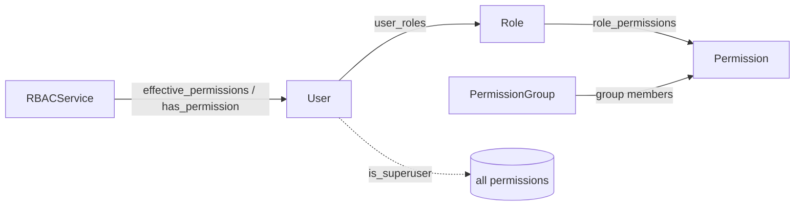
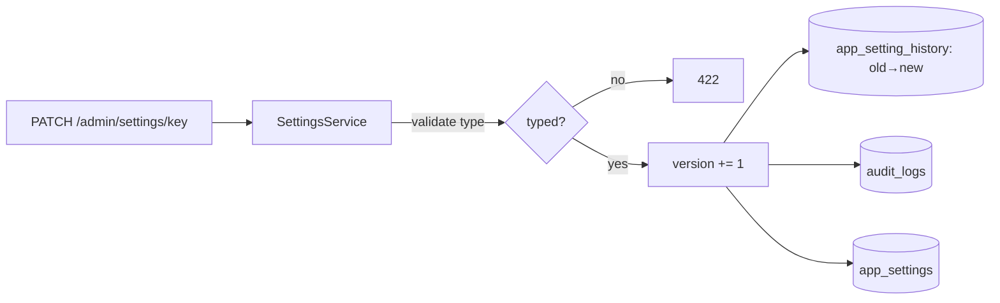
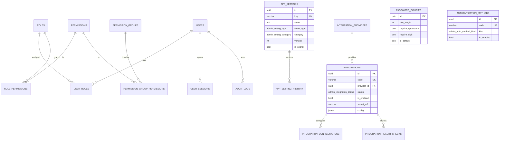
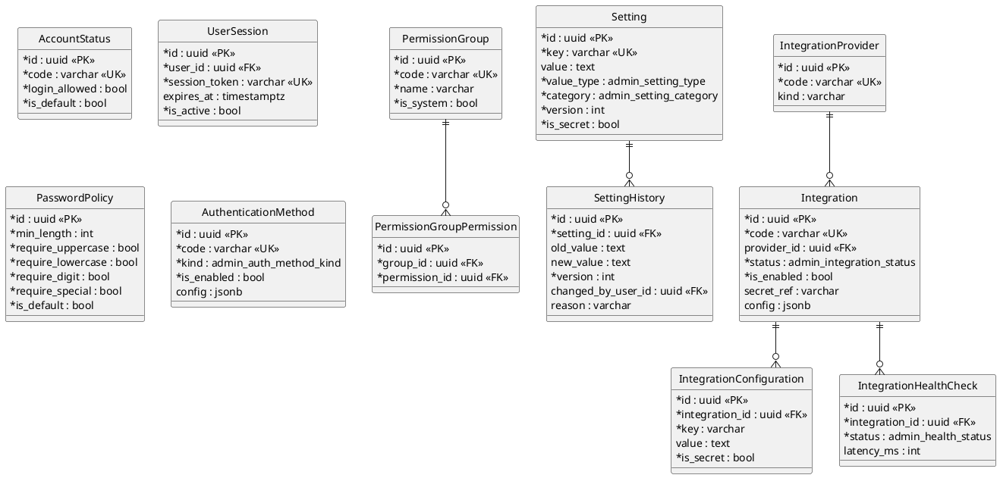

# Administration Platform (Stage 13)

This module (`backend/app/admin/`) is the single **administration platform** for
managing users, roles and permissions (RBAC), system **settings**, **directories**
(catalogs), **integrations** and operational parameters, plus **audit-log** views.

It contains **no dispatch business logic** and **does not modify** any existing
business module — it **reuses** the Stage-2 RBAC tables (`users` / `roles` /
`permissions` / `user_roles` / `role_permissions`) and the existing `audit_logs`
trail unchanged, and adds the administrative concepts around them.

## Module layout

```
backend/app/admin/
├── models/          # 12 new tables + enums + shared enum types
├── rbac/            # RBACService (effective permissions, checks)
├── audit/           # AdminAuditRecorder (writes the existing audit_logs)
├── settings/        # (settings service lives in services/; seam for import/export)
├── services/        # User / Role / Settings / Directory / Integration / Audit / AIAdmin
├── schemas/         # Pydantic request / response
├── validators/      # (seam) — validation lives in utils.passwords / services
├── notifications/   # (seam) — future admin alerts
├── utils/           # passwords (PBKDF2), actor, ORM → schema mapping
└── deps.py · router.py · exceptions.py · api/*.py
```

## Entities

**Reused unchanged:** `users`, `roles`, `permissions`, `user_roles`,
`role_permissions`, `audit_logs`, and the catalog tables.

**New (12 tables):**

| Table | Purpose |
|-------|---------|
| `permission_groups` + `permission_group_permissions` | Bundle permissions to ease assembling roles. |
| `account_statuses` | Editable catalog of account statuses (active / disabled / locked / pending). |
| `user_sessions` | Session records (no real auth backend yet). |
| `password_policies` | Configurable password rules (length, character classes, age, history). |
| `authentication_methods` | Auth methods — `password` enabled; `ldap` / `active_directory` / `oidc` / `saml` are **architecture only**. |
| `app_settings` + `app_setting_history` | Typed, categorised, **versioned** settings with append-only change history. |
| `integration_providers` | Catalog of integration providers (telephony, GIS, SMS, email). |
| `integrations` + `integration_configurations` + `integration_health_checks` | Configured integrations, their key/value config and health-check results. |

Native PG enums: `admin_setting_type`, `admin_setting_category`,
`admin_integration_status`, `admin_health_status`, `admin_auth_method_kind`.

The migration seeds baseline data (4 account statuses, 4 auth methods, 4
integration providers, 1 default password policy) — all editable afterwards.

## RBAC (stage §3)

A user gets permissions **through roles**; a role holds a set of permissions;
permissions are stored in the database; custom roles can be created. A superuser
implicitly holds every permission.



`RBACService.effective_permissions(user_id)` resolves the union of the user's
roles' permissions (or all permissions for a superuser); `has_permission` /
`require_permission` answer checks (`require_permission` raises `403`).

## Settings management (stage §4)

Every setting has a **key, value, type, description, category, version** and an
append-only **change history**. Changing a setting validates the value against
its type, bumps the version, writes a history row (old → new, who, when, why) and
an audit entry. **Secret** settings are masked in every response and their values
are never stored in history in clear text.



Categories: general, maps, routing, ai, search, dispatch, logging, notifications,
integrations, security.

## Directories (stage §5)

A single generic mechanism maintains the system's catalogs **as data, without
code changes**: incident types, resource / vehicle / unit types, capabilities,
statuses, organizations, account statuses, integration providers, … Each catalog
exposes `code` / `name` / `description` plus a few catalog-specific columns
(`extra`). Only registered catalogs are editable; unknown fields are rejected;
every change is audited.

## Integrations (stage §6)

Integrations store connection parameters (`config`, JSONB, **non-secret only**).
**Secrets are never stored in clear text** — a secret is referenced by
`secret_ref` or a config marked `is_secret` holds only a **reference** (a pointer
into a future secret manager), and responses mask them. A (mock) health-check
records a result and updates the integration status.

## AI administration (stage §7)

`GET /admin/ai/providers` reports the AI providers (from the Stage-12 registry,
**unchanged**), their health, model versions and capabilities, the default
provider and AI parameters. Enable/default/parameters are stored as ordinary
settings (category `ai`) — the AI platform itself is not modified.

## Audit (stage §8, §11)

Every administrative change is recorded in the existing `audit_logs`: **who**,
**when**, **old → new** (a JSONB diff) and the **reason** (when provided). Named
**streams** (users, security, settings, integrations, directories) map to
`entity_type` values so the admin UI can present separate journals; `GET
/admin/audit` supports filtering by stream, entity type, action, user and entity.

## Security model

- **RBAC** with database-stored permissions; custom roles; superuser bypass.
- **Passwords** hashed with PBKDF2-HMAC-SHA256 (stdlib), validated against the
  active **password policy**; never returned in any response.
- **Secrets** (settings / integration configs) are masked in responses and kept
  as references, never stored in clear text — ready for a secret manager.
- **External auth** (LDAP / AD / OIDC / SAML) is represented but **not
  implemented**; no SSO / 2FA at this stage.
- **Auditing** of every administrative change (who / when / old → new / reason).

## ER diagram (Mermaid)



## ER diagram (PlantUML)



## REST API (stage §9)

| Method & path | Purpose |
|---------------|---------|
| `GET/POST /api/v1/admin/users`, `GET/PATCH /admin/users/{id}` | manage users |
| `GET /admin/users/{id}/permissions` | a user's effective permissions |
| `GET /admin/auth-methods` | authentication methods |
| `GET/POST /admin/roles`, `GET/PATCH /admin/roles/{id}` | manage roles |
| `GET /admin/permissions`, `GET/POST /admin/permission-groups` | permissions & groups |
| `GET/POST /admin/settings`, `GET/PATCH /admin/settings/{key}`, `GET /admin/settings/{key}/history` | settings |
| `GET /admin/directories`, `GET/POST /admin/directories/{name}`, `PATCH /admin/directories/{name}/{id}` | catalogs |
| `GET/POST /admin/integrations`, `GET/PATCH /admin/integrations/{id}`, `POST /admin/integrations/{id}/health`, `GET /admin/integration-providers` | integrations |
| `GET /admin/audit` | audit log (filter by stream / entity / action / user) |
| `GET /admin/ai/providers` | AI providers & parameters |

Pydantic schemas (stage §10): `UserResponse`, `RoleResponse`,
`PermissionResponse`, `SettingResponse`, `DirectoryItemResponse`,
`IntegrationResponse`, `AuditResponse` (plus create/update inputs, history and AI
schemas).

## Administrator guide (quick)

1. **Create a role** with the permissions it needs (`POST /admin/roles`), then
   **create users** and assign the role (`POST /admin/users` with `role_ids`).
   Check a user's effective rights via `GET /admin/users/{id}/permissions`.
2. **Configure the system** with settings (`POST/PATCH /admin/settings`); secrets
   are masked and versioned with full history.
3. **Maintain catalogs** through directories (`/admin/directories/...`) — add a
   new incident/resource type as data, no deploy needed.
4. **Register an integration** (`POST /admin/integrations`) with non-secret config
   and a `secret_ref`; run a health check.
5. **Review activity** in the audit log (`GET /admin/audit?stream=...`).

## Constraints

No Active Directory, LDAP, SSO or 2FA is implemented (only represented for the
future). No existing business module is modified; all functionality works through
the existing models and services. Administration carries no dispatch logic.

## Next-stage readiness

The design accommodates centralised monitoring, licence management, configuration
backup, settings **export/import** (the settings service + history are the seam),
and centralised management of multiple dispatch centres.

## Tests

- **Unit** (`tests/admin/test_unit.py`): password hashing / validation, typed
  settings parsing, and the directory registry / editable-column detection.
- **Integration** (`tests/admin/test_service_pg.py`, PostgreSQL): user creation +
  RBAC resolution, superuser bypass, password-policy enforcement, audited updates,
  role permission replacement, settings versioning + history, directory create /
  update (+ unknown-field rejection), integration secret masking + health check.
- **API** (`tests/admin/test_api_pg.py`, PostgreSQL): user CRUD + permissions,
  weak-password rejection, roles / permissions, secret-masked settings + history,
  directories, integrations + health + providers, audit stream, AI providers and
  auth methods.

PostgreSQL-backed tests skip automatically when no database is reachable.
