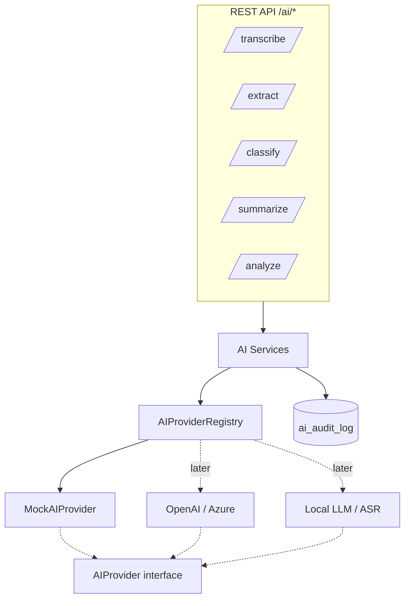
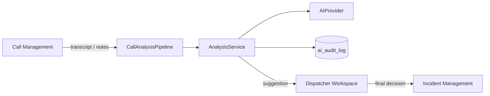
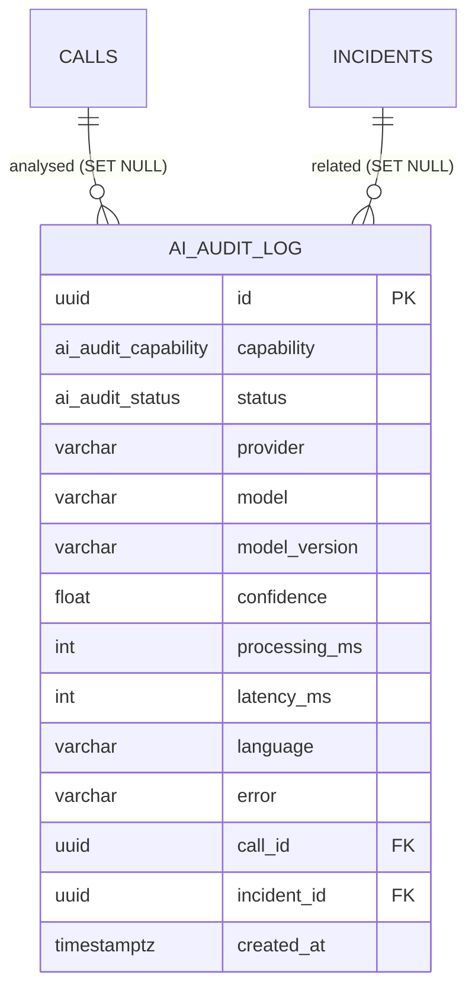
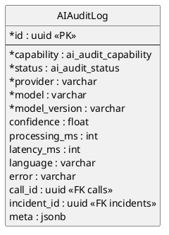
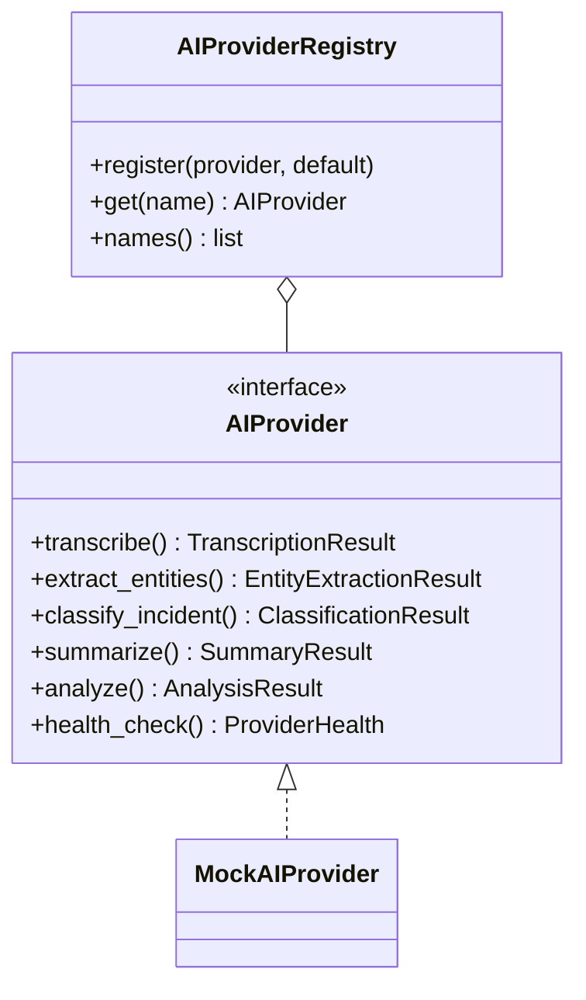

# AI Services Platform (Stage 12)

This module (`backend/app/ai/`) is a **platform** that unifies the system's
intelligent services — transcription, entity extraction, incident classification,
summarisation and combined analysis — behind **one abstraction layer**. Each
service is connected independently, and **replacing the AI model never touches
business logic**: services depend only on the `AIProvider` interface.

Every AI output is a **recommendation for the dispatcher**. The platform never
changes an incident, dispatches units, edits rules or changes resource statuses —
the dispatcher always makes the final decision.

## Module layout

```
backend/app/ai/
├── interfaces/      # AIProvider interface + result dataclasses (the abstraction)
├── providers/       # MockAIProvider + registry (connect more providers here)
├── services/        # one service per capability + audit recorder
├── pipelines/       # CallAnalysisPipeline (Call Management integration)
├── models/          # AIAuditLog ORM + enums + shared enum types
├── schemas/         # Pydantic request / response
├── prompts/         # prompt templates (used by real LLM providers)
├── repositories/    # AIAuditRepository (read the audit log)
├── utils/           # text analysis (mock heuristics), timing, mapping
└── deps.py · router.py · api/ai.py
```

> The Stage-1 `app/ai/base.py` seam is left untouched; this platform adds the new
> subpackages around it.

## The `AIProvider` interface (stage §2)

One interface, implemented by every backend:

```python
class AIProvider(ABC):
    async def transcribe(audio_ref, *, language=None, sample_text=None) -> TranscriptionResult
    async def extract_entities(text, *, language="ru") -> EntityExtractionResult
    async def classify_incident(text, *, language="ru") -> ClassificationResult
    async def summarize(text, *, language="ru") -> SummaryResult
    async def analyze(text, *, language="ru") -> AnalysisResult
    async def health_check() -> ProviderHealth
```

Each result carries an **`AIResultMeta`** — `provider`, `model`, `model_version`,
`confidence`, `processing_ms` (stage §8).

The only implementation now is **`MockAIProvider`** — an offline, deterministic
provider using Russian keyword / regex heuristics (`utils/text_analysis.py`). No
network, no ML. A **registry** (`providers/registry.py`) holds providers by name
with a default, so **several providers can be connected at once** and selected per
request — OpenAI, Azure OpenAI, a local LLM, a specialised ASR model — with **no
business-logic change**.



## Services

| Service | Capability (stage) | Output (a **suggestion**) |
|---------|--------------------|---------------------------|
| `TranscriptionService` | §4 transcription | text, language, temporal segments, confidence |
| `EntityExtractionService` | §5 entities | address, incident type, category, objects, phone, reporter, extra |
| `ClassificationService` | §6 classification | suggested incident type, category, priority |
| `SummaryService` | §7 summary | short human-readable description |
| `AnalysisService` | §7/§9 combined | summary + entities + classification in one bundle |

Every service resolves a provider from the registry, runs it behind the
interface, measures the latency and writes an **audit** entry (success or error).
`EntityExtractionService` returns the entities **as a suggestion** and never reads
or writes any Incident field.

Example (mock) output for *"пожар в многоквартирном жилом доме … внутри есть
люди … улица Ленина, дом 10"*:

- **classification** → type `fire`, category `fire`, priority `critical`
  (escalated because people are reported inside)
- **entities** → address "улица Ленина, дом 10", phone, reporter, object
  "многоквартирный жилой дом"
- **summary** → *"Сообщение: пожар в объекте типа «многоквартирный жилой дом».
  Возможны люди внутри. Адрес: улица Ленина, дом 10."*

## Integration (stage §9)

- **Call Management** — `CallAnalysisPipeline` (`POST /ai/calls/{id}/analyze`)
  reads a call's transcript (or notes) **read-only**, runs the combined analysis
  and returns a suggestion bundle; the audit entry is linked to the call (and its
  incident). It never modifies the call.
- **Incident Management** — extraction / classification are advisory; requests may
  carry an `incident_id` purely so the audit links the suggestion to a card. **No
  Incident field is ever changed by the AI.**
- **Dispatcher Workspace** — consumes the `/ai/*` endpoints; every response is
  flagged `advisory=true`.



## Audit (stage §12)

Every AI call writes an `ai_audit_log` row with **metadata only**: provider,
model, model version, capability, success / error, confidence, processing time,
response latency, language and the related call / incident. **Prompts and the
conversation text are never stored** — per the security / data-retention
requirement, only the model metadata is journaled.

## ER diagram (Mermaid)



## ER diagram (PlantUML)



## AIProvider class diagram



## REST API (stage §10)

| Method & path | Purpose |
|---------------|---------|
| `POST /api/v1/ai/transcribe` | transcribe audio (or `sample_text` for the mock) |
| `POST /api/v1/ai/extract` | extract entities (suggestion) |
| `POST /api/v1/ai/classify` | classify incident (recommendation) |
| `POST /api/v1/ai/summarize` | summarise the conversation |
| `POST /api/v1/ai/analyze` | combined analysis over text |
| `POST /api/v1/ai/calls/{id}/analyze` | analyse a call's transcript *(integration)* |
| `GET /api/v1/ai/providers` | list connected providers + capabilities |
| `GET /api/v1/ai/health` | platform / provider health |
| `GET /api/v1/ai/audit` | AI audit log (metadata only) |

Pydantic schemas (stage §11): `TranscriptionRequest`, `TranscriptionResponse`,
`EntityExtractionResponse`, `ClassificationResponse`, `SummaryResponse`,
`AnalysisResponse`, `AIProviderInfo` (plus `TextRequest`, `AIResultMeta`,
`AIAuditResponse`).

## Usage scenarios

1. **Live call assist** — a dispatcher opens a call; `POST /ai/calls/{id}/analyze`
   returns a summary, extracted address/phone/reporter and a suggested type /
   category / priority. The dispatcher reviews and decides; nothing is auto-applied.
2. **Paste-and-classify** — `POST /ai/classify` on a free-text description returns
   a recommended category and priority.
3. **Provider swap** — connecting OpenAI / a local LLM is registering it in the
   registry; endpoints and services are unchanged.

## Constraints

The AI may **not** automatically change an incident, dispatch units, change rules
or change resource statuses. All results are **suggestions**; the dispatcher makes
the final decision. Prompts and call text are **not** written to the audit log.

## Next-stage readiness

The design already accommodates: **several providers at once** (the registry),
a **task queue** for long AI operations (services are async and stateless), **local
offline models** (the mock is offline; providers need no Internet), **model-version
journaling** (recorded on every audit row) and **AI quality evaluation** (audit
confidence + latency per model).

## Tests

- **Unit** (`tests/ai/test_unit.py`): the text-analysis heuristics (address /
  phone / reporter / objects / priority escalation), the full `MockAIProvider`
  (transcribe / extract / classify / summarise / analyze / health) and the
  registry (default, lookup, unknown-provider error).
- **Integration** (`tests/ai/test_service_pg.py`, PostgreSQL): each service writes
  a success audit row with model metadata, the `CallAnalysisPipeline` over a
  seeded call + transcript, the "no text" validation error, and the **error path**
  (a failing provider is audited as `error` and the exception re-raised).
- **API** (`tests/ai/test_api_pg.py`, PostgreSQL): all endpoints, the call-analysis
  integration, provider listing / health, and the audit log (records metadata,
  never prompt text).

PostgreSQL-backed tests skip automatically when no database is reachable.
