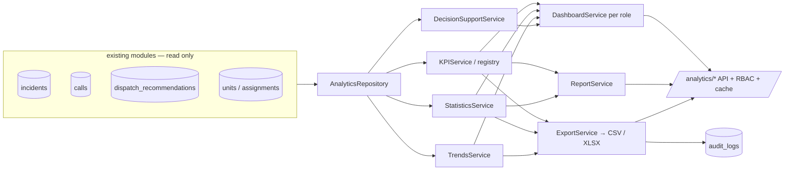

# Operational Analytics Platform (Stage 15)

This module (`backend/app/analytics/`) is the **operational-intelligence** layer:
it gives management and dispatchers objective information about the service and
units — KPIs, role dashboards, statistics, trends, decision-support findings,
reports and exports.

It is **read-only**: it consumes the existing modules' data **through their public
models**, never changes their data, and **never influences real-time operational
decisions** (no effect on the Dispatch Engine). It adds **no database tables** —
everything is computed on demand from existing data and cached briefly.

## Module layout

```
backend/app/analytics/
├── kpi/           # KPI framework: base + extensible registry + built-in definitions
├── statistics/    # StatisticsService (distributions, averages)
├── services/      # KPI · Trends · DecisionSupport · Export services
├── dashboards/    # per-role dashboard policy + assembly service
├── reports/       # ReportService (daily/weekly/monthly/custom)
├── export/        # unified export: CSV + (stdlib) XLSX writers
├── repositories/  # AnalyticsRepository (read-only aggregate queries)
├── schemas/       # Pydantic responses
├── utils/         # period, TTL cache, RBAC guard, masking-free mapping
├── models/        # (none — read-only; seam for snapshot models)
└── deps.py · router.py · api/analytics.py
```

## Data sources (stage §2)

Reads (never writes) via existing models: **Incident Management** (`incidents`,
`incident_dispatches`, `incident_recommendations`), **Call Management** (`calls`),
**Dispatch Engine** (`dispatch_recommendations`), **Resource Management**
(`units`, `resource_assignments`, availability), **Administration** (`users`,
RBAC) and **Observability** (patterns). Aggregation is pushed into the database
(counts / averages / groupings) for performance.

## KPIs (stage §3)

A KPI is a small descriptor (`key`, `name`, `unit`, async `compute`) held in an
**extensible registry** — adding a KPI is `DEFAULT_KPIS.register(KPI(...))` in any
module, **no existing code changes**.

| KPI | Calculation |
|-----|-------------|
| Количество вызовов | `count(calls)` in period |
| Количество происшествий | `count(incidents)` in period |
| Среднее время регистрации вызова | `avg(call.wait_seconds)` (received → answered) |
| Среднее время принятия решения | `avg(incident.confirmed_at − reported_at)` |
| Среднее время назначения подразделений | `avg(first dispatch.assigned_at − incident.reported_at)` |
| Среднее расчётное время прибытия | *unavailable* (routing ETA is not persisted; not fabricated — no forecasting) |
| Нагрузка на диспетчеров | `calls with dispatcher / distinct dispatchers` |
| Нагрузка на подразделения | `assignments / distinct units` |
| Процент использования ресурсов | `units not available_for_dispatch / total units` (snapshot) |
| Процент подтверждённых рекомендаций | `incidents with a recommendation that led to a dispatch / incidents with a recommendation` |

All values are `None` when the underlying data is absent (honest, no fabrication).

## Statistics (stage §6)

`StatisticsService` computes: distribution by **incident type**, by **district**
(administrative area), **unit load**, **call dynamics** (per-day buckets), the
**average units per incident**, **average processing time** (`closed_at −
reported_at`) and the **recommendation-change frequency** (revisions per
incident).

## Trends & Decision Support (stage §7)

`TrendsService` compares each KPI's current window to the equal preceding window
and reports direction (`up` / `down` / `flat`) and change % — **descriptive only,
no forecasting**. `DecisionSupportService` turns aggregates into **advisory
findings**: overloaded districts / units (above the mean by a factor), long
processing time, and rising-load trends. It **never** changes Dispatch-Engine
recommendations or any data.

## Dashboards (stage §4)

Four role dashboards, each with its own KPI set and sections:

| Role | KPIs | Statistics | Findings | Trends |
|------|------|:----------:|:--------:|:------:|
| Руководитель смены | volume + time + load subset | ✓ | ✓ | – |
| Начальник гарнизона | incidents / assignment / load / utilization | ✓ | ✓ | ✓ |
| Администратор системы | **all** KPIs | ✓ | ✓ | ✓ |
| Диспетчер | calls / incidents / registration / load | – | – | – |

## Reports (stage §5) & Export Service

`ReportService` produces **daily / weekly / monthly / custom-period** reports
(KPIs + statistics). The single **`ExportService`** renders any dataset (KPIs, a
statistics section, or trends) to **CSV** or **XLSX** — the XLSX writer is
pure-stdlib (an OOXML zip, no third-party dependency); **PDF plugs into the same
interface later**. Every export is **audited** (to the existing `audit_logs`,
metadata only).

## Performance (stage §10)

Aggregation is done in SQL; results are cached in a short-TTL in-process cache
(`TTLCache`, Redis-swappable). Long-report background computation and a report
scheduler are left as seams (no concrete task backend at this stage).

## Security (stage §11)

Reports honour **RBAC** (reusing the Administration RBAC service): when a user is
identified (`actor_id`), a required permission is enforced — `analytics.view` for
reads, `analytics.export` for export, `analytics.admin` for the admin dashboard
(superuser bypasses). Exports are **logged**. With no auth wired, reads are open
in development. Analytics never exposes secrets or personal data beyond aggregate
counts.

## Observability-style data flow



## REST API (stage §8)

| Method & path | Purpose |
|---------------|---------|
| `GET /api/v1/analytics/kpi` | KPI report for a period |
| `GET /api/v1/analytics/statistics` | operational statistics |
| `GET /api/v1/analytics/dashboard/{role}` | a role dashboard |
| `GET /api/v1/analytics/reports` | generate a report |
| `GET /api/v1/analytics/trends` | KPI trends vs the previous window |
| `GET /api/v1/analytics/decision-support` | advisory findings |
| `POST /api/v1/analytics/export` | export a dataset (CSV / XLSX) |

All accept a `period` (`day` / `week` / `month` / `custom` with `start` / `end`)
and an optional `actor_id` for RBAC. Pydantic schemas (stage §9): `KPIResponse`,
`StatisticsResponse`, `DashboardResponse`, `ReportResponse`, `TrendResponse`,
`ExportRequest`.

## Constraints

Changes no existing data; does not affect the Dispatch Engine; uses **no AI** for
KPIs and performs **no forecasting**; never modifies incidents. All access is via
existing public models / services.

## Next-stage readiness

The design accommodates predictive analytics and ML (the trends/decision seams),
**custom KPIs** (the registry) and **custom reports** (the report + export
seams), and BI integrations (the export interface). The next (final) stage
prepares the system for production operation and can consume this platform's data.

## Tests

- **Unit** (`tests/analytics/test_unit.py`): period windows, the extensible KPI
  registry, trend-direction math, overloaded-detection, the TTL cache, and the
  CSV / XLSX writers (valid zip + content).
- **Integration** (`tests/analytics/test_service_pg.py`, PostgreSQL): **exact KPI
  values** against a deterministic seed (calls, registration/decision/assignment
  times, dispatcher/unit load), statistics distributions, period scoping and the
  role dashboards.
- **API** (`tests/analytics/test_api_pg.py`, PostgreSQL): every endpoint, CSV +
  XLSX export with **export auditing**, and **RBAC** (an unpermitted user gets
  403; the admin dashboard requires `analytics.admin`).

PostgreSQL-backed tests skip automatically when no database is reachable.
