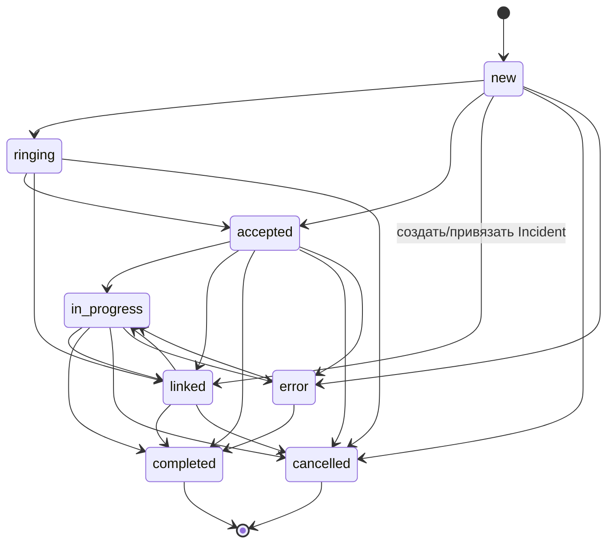
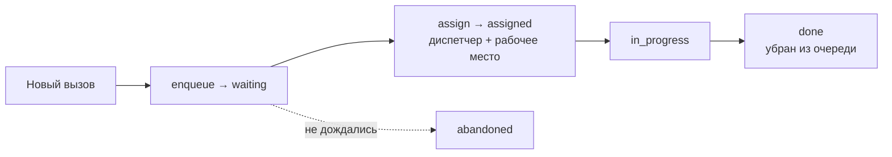
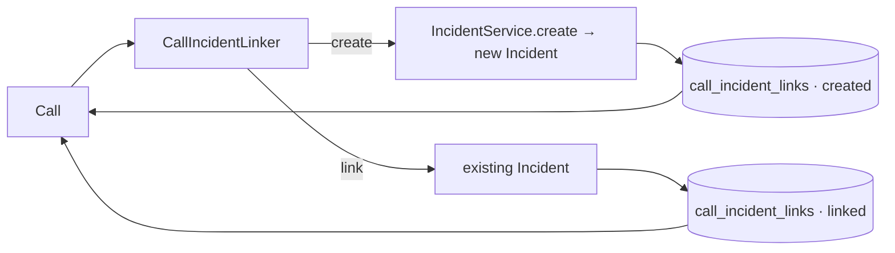
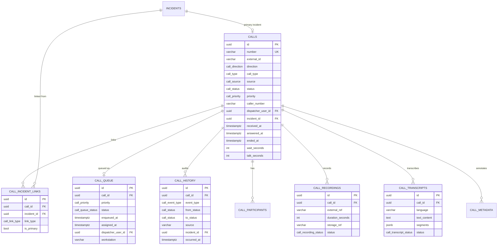
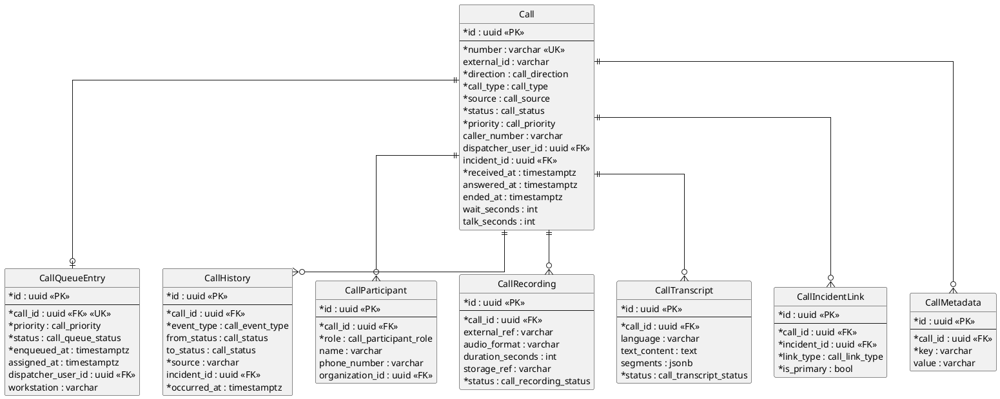

# Call Management (Stage 11)

This module (`backend/app/calls/`) is the **reception, registration and
processing of emergency calls**. Every incoming call becomes its own entity and
is linked to one or more **incident** cards (Stage 9). Around the call it models
the dispatch **queue** (multi-workstation), an append-only **history**,
**participants**, **recordings** and **transcripts** (architecture only — no
audio / ASR yet), the **incident links** and free-form **metadata**.

This stage delivers the **infrastructure**. Real telephony, call recording and
speech recognition are deliberately **not** implemented; they plug into the seams
described below without changing the module. The Dispatch Engine and Incident
Management modules are **not modified** — only Incident Management's public
service is consumed.

## Module layout

```
backend/app/calls/
├── models/          # SQLAlchemy: 8 tables + enums + shared enum types
├── validators/      # the call lifecycle state machine (allowed transitions)
├── providers/       # CallProvider interface + MockCallProvider (telephony seam)
├── queue/           # CallQueueManager (priority queue, multi-workstation)
├── history/         # CallHistoryRecorder (append-only audit)
├── repositories/    # CallRepository (eager reads, queue & history queries)
├── services/        # CallService + CallIncidentLinker (incident create/link)
├── schemas/         # Pydantic Create / Update / Response
├── utils/           # Actor, ORM → schema mapping
└── deps.py · router.py · api/calls.py
```

## Entities

| Table | Purpose |
|-------|---------|
| `calls` | The call card: number, external (provider) id, direction, **type**, **source**, **status**, **priority**, caller / callee number, dispatcher, linked incident, and the reception / answer / end timestamps + wait / talk durations. |
| `call_queue` | The call's position in the dispatch queue: priority, status, arrival time, assigned dispatcher / **workstation**, wait time. |
| `call_history` | **Append-only** history: status changes, queueing, dispatcher assignment, incident creation / linking, provider actions — with actor, source, old → new status and the related incident. |
| `call_participants` | Parties on the call (caller, dispatcher, transfer target, …). |
| `call_recordings` | Recording **metadata** only (external ref, format, duration, storage location, processing status) — no audio. |
| `call_transcripts` | Transcript **placeholder** (source text, temporal segments as JSONB, language, processing status) — no ASR. |
| `call_incident_links` | Links a call to incident cards (`created` vs `linked`, primary flag). |
| `call_metadata` | Free-form key/value metadata (extension seam). |

Enums (native PostgreSQL): `call_status`, `call_priority`, `call_type`,
`call_source`, `call_direction`, `call_event_type`, `call_queue_status`,
`call_participant_role`, `call_recording_status`, `call_transcript_status`,
`call_link_type`.

The domain concepts **CallStatus / CallType / CallSource** are modelled as native
enums (the project convention for lifecycle / classification values), consistent
with the incident module.

## Call lifecycle

Statuses: **Новый** (`new`) → **Ожидает ответа** (`ringing`) → **Принят**
(`accepted`) → **В обработке** (`in_progress`) → **Связан с Incident** (`linked`)
→ **Завершён** (`completed`); **Отменён** (`cancelled`) before completion and
**Ошибка** (`error`) from any active state.

Transitions are enforced by a finite state machine
(`validators/state_machine.py`); **invalid transitions are rejected** (HTTP 422).



Each status change records a `call_history` entry (event, old → new, actor,
source, related incident) and sets the relevant timestamp: `answered_at` (with
the computed `wait_seconds`) on first answer, `ended_at` (with `talk_seconds`) on
completion / cancellation.

## Call queue

A new call enters the queue immediately. The queue supports **priority**, arrival
time (`enqueued_at`), the assigned dispatcher and **workstation**, and a status —
so several dispatcher workstations can pull from one shared queue. Wait time is
computed from the arrival time. The listing is ordered most-urgent first
(priority rank, then arrival time).



Queue statuses: `waiting` → `assigned` → `in_progress` → `done`; `abandoned` when
a call is closed before it was ever answered.

## Integration with Incident Management

Every call either **creates a new incident card** or is **attached to an existing
one**. That selection logic is isolated in a dedicated service —
`CallIncidentLinker` — which reuses the Stage-9 `IncidentService` **unchanged**:



`POST /calls/{id}/incident` takes **either** an `incident_id` (link existing)
**or** `create=true` (create new from the call's caller / address data); providing
both or neither is rejected. On success the call moves to `linked`, `incident_id`
is set to the primary incident, and a `call_incident_links` row records the link
type.

## CallProvider interface (telephony seam)

Telephony is **not** connected at this stage. All interaction with a phone
platform goes through the abstract `CallProvider`
(`providers/base.py`), so a real backend (Asterisk, FreeSWITCH, SIP, WebRTC, …)
can be plugged in later **without changing** the call service:

```python
class CallProvider(ABC):
    async def receive_call(...) -> ProviderCall: ...
    async def answer_call(external_id) -> ProviderCall: ...
    async def end_call(external_id) -> ProviderCall: ...
    async def hold_call(external_id) -> ProviderCall: ...
    async def transfer_call(external_id, *, destination) -> ProviderCall: ...
    async def health_check() -> ProviderHealth: ...
```

The only implementation now is **`MockCallProvider`** — a deterministic in-memory
provider that fully implements the interface (tracked calls, simulated state
transitions). It is wired as a process-wide singleton in `deps.py`, so a call's
provider handle survives across requests. `GET /calls/provider/health` reports
its status.

## Recording & transcription (architecture only)

`call_recordings` stores a recording's **id / external ref, duration, format,
storage location and processing status** — no audio is captured.
`call_transcripts` stores the **source text, temporal segments (JSONB), language
and processing status** — no speech recognition runs. Both exist so a real
recording backend and an ASR engine (and later an AI analyser) can populate them
without schema changes.

## ER diagram (Mermaid)



## ER diagram (PlantUML)



## REST API

| Method & path | Purpose |
|---------------|---------|
| `POST /api/v1/calls` | register a call (optionally register it with the provider) |
| `GET /api/v1/calls` | list calls (summaries; `active` filter) |
| `GET /api/v1/calls/{id}` | full call card |
| `PATCH /api/v1/calls/{id}/status` | change status (state machine) |
| `POST /api/v1/calls/{id}/incident` | create or link an incident *(integration)* |
| `GET /api/v1/calls/queue` | the dispatch queue (most urgent first) |
| `GET /api/v1/calls/history` | call history (global or `?call_id=`) |
| `POST /api/v1/calls/{id}/assign` | assign a dispatcher / workstation |
| `POST /api/v1/calls/{id}/answer` | answer (via the provider) |
| `POST /api/v1/calls/{id}/hold` · `/transfer` · `/end` | telephony actions |
| `GET /api/v1/calls/provider/health` | telephony provider health |

The literal `/calls/queue`, `/calls/history` and `/calls/provider/health` routes
are registered **before** the dynamic `/calls/{call_id}` so they are not shadowed.

Pydantic schemas: `CallCreate`, `CallUpdate`, `CallResponse`,
`CallSummaryResponse`, `CallQueueResponse`, `CallHistoryResponse`,
`CallTranscriptResponse` (plus nested participant / recording / link responses and
the request models for assignment, incident linking and transfer).

## Logging

Every meaningful change is captured in `call_history`: the reception time, the
answer time, the end time, the assigned dispatcher, the created / linked incident
and all status changes — with the actor and source, and **never deleted**.

## Constraints

Per the stage brief this module does **not**: connect real IP telephony,
implement call recording, implement speech recognition, or use AI. It does not
modify the Dispatch Engine or Incident Management. It leaves seams for the next
(AI) stage — real telephony (SIP / Asterisk / FreeSWITCH), recording,
transcription, caller-number lookup, automatic address detection and AI
conversation analysis — to plug in without architectural change.

## Tests

- **Unit** (`tests/calls/test_unit.py`): the lifecycle happy path, rejected
  invalid transitions, reversible `linked`, recoverable `error`, terminal states,
  and the full `MockCallProvider` flow (receive → answer → hold → transfer → end,
  health, unknown-call error).
- **Integration** (`tests/calls/test_service_pg.py`, PostgreSQL): call creation +
  queueing + history, status progression with timestamps, invalid / duplicate
  transition handling, dispatcher assignment, **incident create** and **link
  existing** (with the exactly-one-choice rule), priority queue ordering, the
  provider answer/end flow, recording / transcript registration, append-only
  history.
- **API** (`tests/calls/test_api_pg.py`, PostgreSQL): create / get / list, status
  change (valid + 422), incident create / link / ambiguous-choice, queue,
  dispatcher assignment, history, provider health and the answer/end flow.

PostgreSQL-backed tests skip automatically when no database is reachable.
