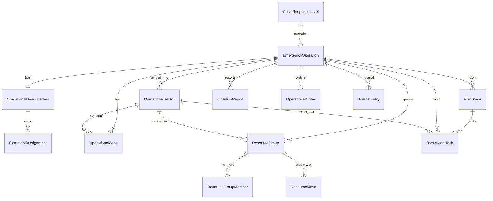
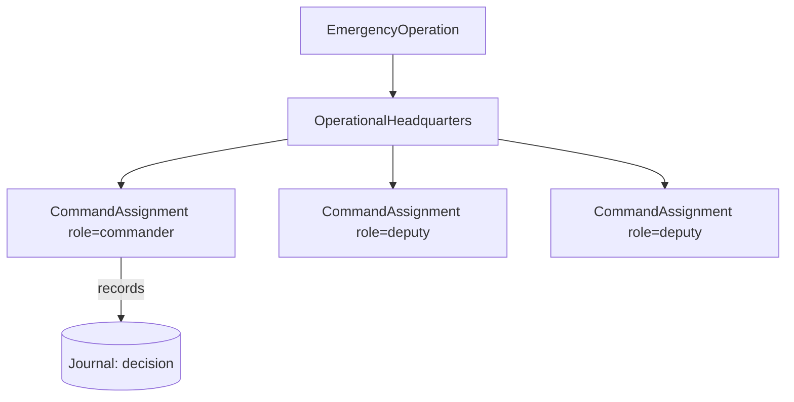
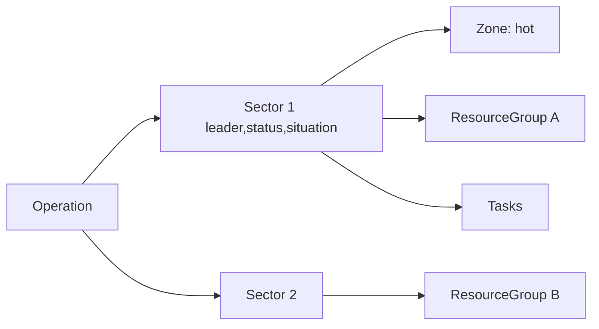

# Crisis Management Platform (Stage 20)

An **overlay** for managing large-scale emergencies where dozens of units,
several commanders and many resources operate at once. It adds the operational
**headquarters**, **sectors**, **resource groupings**, the **operational plan**,
an immutable **journal** and a **situation board** — **without changing** the
Dispatch Engine, incidents, GIS or any existing module. It references existing
data (incidents, units, users) **by id only** and consumes other modules through
their public services.

## Contents
- [Data model (ER)](#data-model-er)
- [Response levels](#response-levels)
- [Headquarters](#headquarters)
- [Sectors](#sectors)
- [Resource management](#resource-management)
- [Operational plan](#operational-plan)
- [Journal (immutable)](#journal-immutable)
- [Situation board](#situation-board)
- [REST API](#rest-api)
- [Security / RBAC](#security--rbac)
- [Commander's guide](#commanders-guide)

## Data model (ER)

All tables are prefixed `crisis_`. Response *levels* are a configurable
reference table (no code change to add one).

Statuses/types are stored as validated `String` values (see
`app/crisis/models/enums.py`); the operation references an incident via
`incident_ref` (a loose id, **no foreign key** into `incidents`).

## Response levels

Configurable modes (§3) live in `crisis_response_levels` and are seeded:
`routine` (Повседневный режим), `heightened` (Повышенная готовность),
`emergency` (Чрезвычайная ситуация), `large_scale` (Крупномасштабная операция).
New levels are added as **rows** — no code change. `GET /crisis/levels`.

## Headquarters

Each operation automatically gets one **headquarters** (§4). A commander
(руководитель ликвидации / РТП) and deputies are assigned with responsibilities;
decisions are recorded to the immutable journal.

Endpoints: `POST /crisis/{id}/command`, `GET /crisis/{id}/command`,
`POST /crisis/{id}/decision`.

## Sectors

The scene is divided into **operational sectors** (участки, §5). Each sector
tracks a leader, status (`forming → active → contained → closed`), the situation
text, an ordering position and optional coordinates. **Zones**
(hot/warm/cold/staging) mark geographic areas for the map.

Endpoints: `POST /crisis/{id}/sector`, `GET /crisis/{id}/sectors`,
`PATCH /crisis/sectors/{sector_id}`, `POST /crisis/{id}/zone`.

## Resource management

Units/vehicles/personnel are combined into **resource groups** (§6), assigned to
a sector, and **relocated** between sectors — each relocation is recorded in
`crisis_resource_moves` (history). Members reference existing resources by id.

Endpoints: `POST /crisis/{id}/resource-group`,
`GET /crisis/{id}/resource-groups`,
`POST /crisis/resource-groups/{group_id}/members`,
`POST /crisis/resource-groups/{group_id}/relocate` (records history),
`GET /crisis/resource-groups/{group_id}/history`.

## Operational plan

The plan (§7) is a set of **stages** (phases) each holding **tasks** with a
title, description, responsible (`assignee_ref`), due time and status
(`pending → in_progress → done / cancelled`). Tasks may also be attached to a
sector.

Endpoints: `POST /crisis/{id}/plan/stages`, `GET /crisis/{id}/plan/stages`,
`POST /crisis/{id}/tasks`, `GET /crisis/{id}/tasks`,
`PATCH /crisis/tasks/{task_id}/status`.

## Journal (immutable)

A **single, append-only** journal (§8) records decisions, actions, situation
changes, assignments and received information. The `JournalService` exposes only
`append` and reads — there is **no update or delete**, so entries are immutable.
Every mutating operation (create/assign/relocate/decision/…) writes a journal
entry, so the platform provides a complete, tamper-evident operational record.

Endpoint: `GET /crisis/{id}/timeline` (optionally `?kind=decision|action|…`).

## Situation board

`GET /crisis/{id}/board` aggregates the live picture (§9): active sectors,
resource groups (forces & means), zones (for the map), the latest situation
report and recent **critical events** (decisions + situation changes).
Geographic rendering uses the **existing GIS API** on the client — the platform
provides coordinates only.

## REST API

| Method & path | Purpose |
|---------------|---------|
| `GET /crisis/operations` | list operations (`?status=`) |
| `POST /crisis/operations` | create operation (auto-creates HQ) |
| `GET /crisis/{id}` | operation detail |
| `PATCH /crisis/{id}` | update operation (name/status/level/…) |
| `GET /crisis/{id}/headquarters` · `POST/GET /crisis/{id}/command` · `POST /crisis/{id}/decision` | headquarters |
| `POST /crisis/{id}/sector` · `GET /crisis/{id}/sectors` · `PATCH /crisis/sectors/{id}` · `POST /crisis/{id}/zone` | sectors & zones |
| `POST /crisis/{id}/resource-group` · `GET /crisis/{id}/resource-groups` · members · relocate · history | resources |
| `POST/GET /crisis/{id}/plan/stages` · `POST/GET /crisis/{id}/tasks` · `PATCH /crisis/tasks/{id}/status` | plan |
| `GET /crisis/{id}/timeline` | immutable journal |
| `POST/GET /crisis/{id}/reports` · `POST /crisis/{id}/orders` | reports & orders |
| `GET /crisis/{id}/board` | situation board |
| `GET /crisis/levels` | configurable response levels |

Errors use the standard contract: `404` not found, `409` conflict (duplicate
code), `422` invalid value, `403` insufficient permission.

## Security / RBAC

Reuses the existing Administration RBAC (§13). Permission codes:
`crisis.view` (read), `crisis.manage` (operations/sectors/plan),
`crisis.command` (headquarters/decisions), `crisis.resource` (resource groups &
relocation). Roles map to these codes: dispatcher → view; РТП / начальник смены →
view+manage(+command as appropriate); оперативный штаб → command; administrator →
all. Consistent with the rest of the system, access is **open when no user is
identified** and enforced once a user id is supplied (`X-User-Id` header). Every
action is journalled, providing the audit trail.

## Commander's guide

For the руководитель ликвидации ЧС:

1. **Open the operation** — `POST /crisis/operations` (choose the response
   level). A headquarters is created automatically.
2. **Staff the headquarters** — assign yourself as `commander` and add deputies
   with responsibilities.
3. **Divide the scene** — create operational sectors; set each sector's leader
   and, as the situation develops, its status and situation text. Mark hazard
   **zones** for the map.
4. **Group your forces** — create resource groups, add units/vehicles/personnel,
   and **relocate** groups between sectors as needed (the move is logged).
5. **Plan** — lay out stages and tasks with responsibles and deadlines; update
   task status as work proceeds.
6. **Command** — record your **decisions** (with rationale); they enter the
   immutable journal.
7. **Report** — file situation reports and issue orders; watch the **situation
   board** for the live picture and critical events.
8. **Review** — the **timeline** is the complete, immutable record of the
   operation for debrief and accountability.

The platform is an overlay: real dispatching, incidents and GIS remain in their
own modules and are never modified here.

## Testing

`tests/crisis/` — DB-free unit tests (enum vocabularies, open-access RBAC,
journal append-only) and PostgreSQL-backed API/scenario tests (operation +
headquarters, command & decisions, sectors & zones, resource grouping &
relocation history, plan & tasks, reports, situation board, and RBAC denial).
The PostgreSQL tests skip when no database is reachable.
