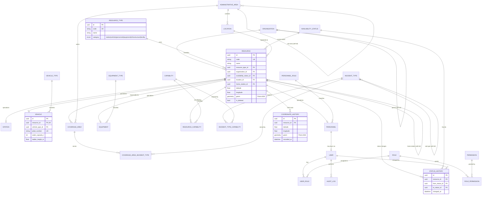

# Data Model — AI Dispatcher МЧС

Stage 2 delivers the foundational data model for the whole system. This document
describes every table, the relationships between them, the normalization
approach, and the indexing / performance strategy.

## 1. Design philosophy — everything is a resource

The core idea: **any manageable object in the system is a `Resource`** — a fire
station, an engine, an aerial ladder, a rescue vehicle, a hydrant, a water
source, a hospital, a police unit, a gas service, a power grid node, a
warehouse, a command post. What a resource *is* comes from its **`ResourceType`**
— a catalog row, not a schema element. Therefore **new kinds of resource are
added as data (a new `ResourceType` row), never as a schema migration.**

Four resource families carry rich, queryable, structured attributes and so have
dedicated **specialization tables** in a 1:1 relationship with `Resource`
(class-table inheritance, no polymorphic magic):

| Family | Table | Examples |
|--------|-------|----------|
| Stations | `stations` | fire stations, depots |
| Vehicles | `vehicles` | pumpers, aerial ladders, rescue trucks, tankers |
| Personnel | `personnel` | commanders, drivers, firefighters, medics |
| Equipment | `equipment` | hoses, breathing apparatus, hydraulic tools |

Everything else (hydrant, water source, hospital, police, gas, power, warehouse,
command post, …) is a **plain `Resource`** distinguished only by its
`ResourceType`. If such an object later needs structured fields, a new
specialization table can be added **without touching `Resource`** — the
architecture does not change.

## 2. ER diagram (Mermaid)

A full, attribute-level diagram is also provided in PlantUML:
[`docs/er-diagram.puml`](er-diagram.puml).

## 3. Tables

Every table has `id` (UUID PK), `created_at`, `updated_at` and `is_deleted`
(soft delete). These common columns are omitted from the descriptions below.

### 3.1 Catalog / lookup tables (the extension mechanism)

| Table | Purpose | Key columns |
|-------|---------|-------------|
| `resource_types` | Kinds of resource; `category` selects the specialization | `code`, `name`, `category` |
| `vehicle_types` | Apparatus classes (АЦ, АЛ, АР, …) | `code`, `name` |
| `personnel_roles` | Functional roles (commander, driver, medic, …) | `code`, `name` |
| `equipment_types` | Equipment classes (hose, SCBA, hydraulic tool, …) | `code`, `name` |
| `availability_statuses` | Operational statuses + dispatch flags | `code`, `is_operational`, `is_available_for_dispatch` |
| `capabilities` | Functions a resource provides / an incident needs | `code`, `name` |
| `incident_types` | Incident categories, self-nesting | `code`, `name`, `parent_id` |
| `incident_type_capabilities` | Capabilities required per incident type (M:N) | `incident_type_id`, `capability_id`, `min_quantity` |

### 3.2 Organization & core

| Table | Purpose | Key columns |
|-------|---------|-------------|
| `organizations` | Owner/operator of resources, self-nesting hierarchy | `code`, `name`, `parent_id` |
| `resources` | **Universal asset** — geo, type, owner, status | `code`, `resource_type_id`, `organization_id`, `availability_status_id`, `location_id`, `home_station_id`, `latitude`, `longitude`, `geom` |
| `resource_capabilities` | Capabilities a resource provides (M:N) | `resource_id`, `capability_id`, `quantity` |

### 3.3 Resource specializations (1:1 with `resources`)

| Table | Purpose | Key columns |
|-------|---------|-------------|
| `stations` | Fire station specifics | `resource_id` (UK), `station_number`, `garage_capacity`, `staff_capacity` |
| `vehicles` | Vehicle specifics | `resource_id` (UK), `vehicle_type_id`, `plate_number`, `water_capacity_l`, `foam_capacity_l`, `pump_capacity_l_min`, `ladder_height_m` |
| `personnel` | Person specifics | `resource_id` (UK), `personnel_role_id`, `first_name`, `last_name`, `rank`, `badge_number` |
| `equipment` | Equipment specifics | `resource_id` (UK), `equipment_type_id`, `serial_number`, `quantity` |

### 3.4 Geospatial

| Table | Purpose | Key columns |
|-------|---------|-------------|
| `administrative_areas` | Territorial hierarchy (region→city→district) | `code`, `name`, `level`, `parent_id`, `boundary (MultiPolygon,4326)` |
| `locations` | Reusable structured address + point | `address`, `administrative_area_id`, `latitude`, `longitude`, `geom (Point,4326)` |
| `coverage_areas` | Response zone (area of responsibility) of a resource | `name`, `resource_id`, `administrative_area_id`, `priority`, `area (MultiPolygon,4326)` |
| `coverage_area_incident_types` | Incident types a coverage area serves (M:N) | `coverage_area_id`, `incident_type_id`, `priority` |

### 3.5 History (high-volume, append-only)

| Table | Purpose | Key columns |
|-------|---------|-------------|
| `status_history` | Every availability-status transition | `resource_id`, `from_status_id`, `to_status_id`, `changed_at`, `changed_by_user_id` |
| `coordinate_history` | GPS track points of mobile resources | `resource_id`, `latitude`, `longitude`, `geom (Point,4326)`, `recorded_at`, `speed_kmh`, `heading_deg` |

### 3.6 Security (RBAC) & audit

| Table | Purpose | Key columns |
|-------|---------|-------------|
| `users` | System users (dispatchers, admins) | `username` (UK), `email` (UK), `hashed_password`, `personnel_id` |
| `roles` | Named roles | `code`, `name`, `is_system` |
| `permissions` | Fine-grained permissions (`resource:read`, …) | `code`, `name` |
| `user_roles` | Users ↔ roles (M:N) | `user_id`, `role_id` |
| `role_permissions` | Roles ↔ permissions (M:N) | `role_id`, `permission_id` |
| `audit_logs` | Append-only action trail | `user_id`, `action`, `entity_type`, `entity_id`, `changes (JSONB)`, `occurred_at` |

## 4. Relationships (summary)

- **Owner / classification:** `resources` → `organizations`, `resource_types`,
  `availability_statuses`, `locations`; self-referential `home_station_id`.
- **Specialization:** `resources` 1:1 `stations` / `vehicles` / `personnel` /
  `equipment` (via unique `resource_id`).
- **Typing of specializations:** `vehicles`→`vehicle_types`,
  `personnel`→`personnel_roles`, `equipment`→`equipment_types`.
- **Capabilities:** `resources` ↔ `capabilities` (M:N via
  `resource_capabilities`); `incident_types` ↔ `capabilities` (M:N via
  `incident_type_capabilities`).
- **Geography:** `administrative_areas` self-nest; `locations` →
  `administrative_areas`; `coverage_areas` → `resources` /
  `administrative_areas`; `coverage_areas` ↔ `incident_types` (M:N).
- **History:** `status_history` and `coordinate_history` → `resources` (1:N).
- **Security:** `users` ↔ `roles` ↔ `permissions` (M:N chains); `users` →
  `personnel` (optional); `audit_logs` → `users`.

## 5. Normalization (≥ 3NF)

- **1NF** — every column is atomic; no repeating groups or arrays of related
  data. Multi-valued relationships use junction tables
  (`resource_capabilities`, `user_roles`, `role_permissions`,
  `coverage_area_incident_types`, `incident_type_capabilities`).
- **2NF** — all tables have a single-column surrogate UUID key; non-key columns
  depend on the whole key.
- **3NF** — classifications that would otherwise be repeated descriptive
  attributes are extracted into catalog tables (`resource_types`,
  `vehicle_types`, `availability_statuses`, …). A resource stores only the FK to
  its status, not the status label/color, so there is no transitive dependency.

**JSON usage** is confined to `audit_logs.changes` — an intentionally schemaless
diff of arbitrary entities. No first-class related data is stored as JSON.

## 6. Performance & scale

Target: **100 000+ resources** and **millions of history rows**.

**Indexes created by the migration**

- B-tree on every foreign key (e.g. `resource_type_id`, `organization_id`,
  `availability_status_id`, `home_station_id`).
- Partial composite index `ix_resources_active (organization_id,
  resource_type_id, availability_status_id) WHERE is_deleted = false` — the hot
  path for "available resources of a type in an org".
- `is_deleted` indexed on every table (soft-delete filtering).
- Unique constraints on natural keys (`resources.code`, `vehicles.plate_number`,
  `users.username`, `users.email`, junction pairs, …).
- Composite time indexes on history: `ix_status_history_resource_time
  (resource_id, changed_at)`, `ix_coordinate_history_resource_time (resource_id,
  recorded_at)` for "latest / recent for a resource".
- **Spatial GiST indexes** on all geometry columns: `resources.geom`,
  `locations.geom`, `coordinate_history.geom`, `administrative_areas.boundary`,
  `coverage_areas.area` — for radius / bounding-box / containment queries.
- Audit: `ix_audit_logs_entity (entity_type, entity_id)` and
  `ix_audit_logs_user_time (user_id, occurred_at)`.

**Recommendations for the next phase** (documented, not yet implemented so as
not to over-engineer the foundation):

1. **Range-partition the history tables** by time (e.g. monthly) on
   `changed_at` / `recorded_at`. Both tables are designed for this — queries and
   indexes already lead with `resource_id` + time. Add a **BRIN** index on the
   time column per partition for cheap range scans.
2. **Consider a "current position" cache** (a `resources.geom` already holds the
   live point) so map queries never touch `coordinate_history`.
3. **Retention / archival** for `coordinate_history` and `audit_logs` (drop old
   partitions instead of `DELETE`).
4. **Covering indexes** for the busiest list endpoints once access patterns are
   measured (avoid speculative indexes now).
5. If write throughput on telemetry becomes a bottleneck, batch-insert
   `coordinate_history` and/or route it through a queue.

## 7. Extending the model without changing the architecture

1. New **resource kind** → insert a `resource_types` row. Done.
2. New **structured asset family** → add a specialization table with a unique
   `resource_id` FK; `resources` is untouched.
3. New **classification** (status, capability, role, …) → insert catalog rows.
4. New **attribute** on an existing family → add a nullable column to that
   specialization table.

All of the above are additive: no existing table is restructured, satisfying the
"ready for the next stages without rework" Definition of Done.
