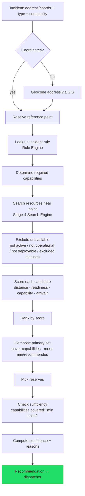
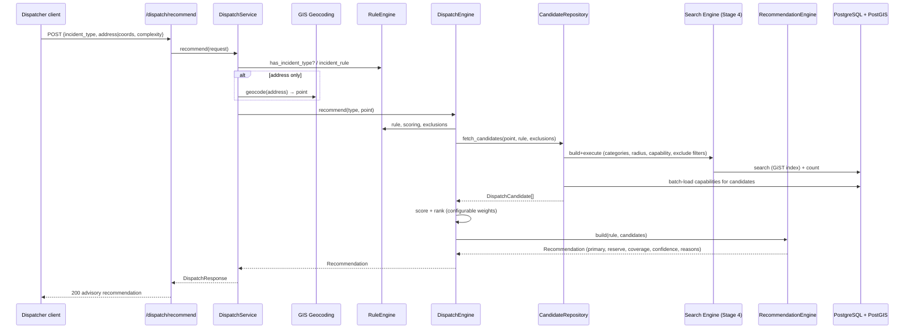

# Automatic Dispatch Recommendation (Stage 5)

The decision-support core (`backend/app/dispatch/`). Given an incident (address
or coordinates + type + complexity) it forms a **recommended composition of
forces and equipment** for the dispatcher. It reuses the Stage-2 data model,
Stage-3 GIS and the Stage-4 Search Engine without changing them.

> **Advisory only.** The module never sends units, builds routes, computes ETA,
> uses AI, or talks to external systems. The dispatcher makes the final decision.

## Module layout

```
backend/app/dispatch/
├── rules/               # Rule Engine (externalized rules)
│   ├── models.py        #   IncidentRule, CapabilityRequirement, ScoringConfig…
│   ├── provider.py      #   RuleProvider ABC + File/InMemory providers
│   ├── engine.py        #   RuleEngine (typed lookups, reload)
│   └── default_rules.yaml   # the rules — edited without code changes
├── algorithms/
│   ├── scoring.py       #   RecommendationScore + configurable Scorer + ETA seam
│   ├── candidate.py     #   DispatchCandidate (resource + distance + caps + score)
│   └── selection.py     #   DispatchSelectionStrategy (Stage-4 seam impl)
├── repositories/        # CandidateRepository (reuses Search Engine; loads caps)
├── recommendations/     # RecommendationEngine (composition, sufficiency, confidence)
├── services/            # DispatchService (geocode → engine → schemas)
├── schemas/             # DispatchRequest/Response, Recommendation, RuleResponse…
├── utils/               # readiness classification, domain→schema mapping
├── engine.py            # DispatchEngine (coordinator)
├── deps.py · router.py · api/dispatch.py
```

## Decision flow



`*` arrival time is scored only when a routing/ETA estimator is present — a seam
for the next stage; today it is absent and contributes nothing.

## Sequence



## Rule Engine (rules outside the code)

All rules live in **`rules/default_rules.yaml`** (override via
`DISPATCH_RULES_PATH`). Operators add incident types and tune every coefficient
without touching Python — **no magic values in the algorithm**. `RuleEngine.reload()`
re-reads the file at runtime. A DB- or admin-API-backed `RuleProvider` can be
added later without changing the engine.

### Per incident type

| Field | Meaning |
|-------|---------|
| `priority` | 1 = highest |
| `resource_categories` | which resource families to consider (vehicle, personnel, …) |
| `required_capabilities` | `{code, min_quantity, label}` the incident needs |
| `minimum_units` | minimum acceptable composition size |
| `recommended_units` | target composition size |
| `reserve_units` | how many reserves to suggest |
| `search_radius_meters` | how far to look |
| `candidate_limit` | max candidates scanned |

### Shipped incident types

`fire` (Пожар), `forest_fire` (Лесной пожар), `dtp` (ДТП), `smoke` (Задымление),
`chemical` (Химическая авария), `gas_leak` (Утечка газа), `collapse` (Обрушение),
`rescue` (Спасательные работы), `false_alarm` (Ложный вызов), `other` (Прочие).
Add a new one by appending a `incident_types` entry — no code change.

### Scoring (all coefficients configurable)

`score = Σ(weightᵢ · sub-scoreᵢ) / Σ(active weightsᵢ)`, each sub-score in 0..1:

- **distance** — linear decay to 0 at `max_distance_meters`;
- **readiness** — `deployable` / `operational` / `other` values from config;
- **capability_match** — fraction of the incident's required capabilities the
  resource provides;
- **arrival_time** — only when an `ArrivalEstimator` is plugged in (next stage);
  its weight is excluded from normalization until then.

**Confidence** combines capability coverage, unit fill and mean score, mapped to
`high` / `medium` / `low` by configurable thresholds.

### Exclusions

Resources are excluded when not active, not operational, not deployable, or their
availability status code is in `excluded_status_codes` (e.g. `maintenance`,
`out_of_service`, `busy`, `reserved`).

## REST API

| Method & path | Purpose |
|---------------|---------|
| `POST /dispatch/recommend` | full recommended composition (advisory) |
| `POST /dispatch/preview` | quick preview (top candidates, no reserves) |
| `GET /dispatch/rules` | the configured incident rules |
| `GET /dispatch/capabilities` | the capability catalog |

### Example — request

```
POST /api/v1/dispatch/recommend
{
  "incident_type": "fire",
  "address": "Красная площадь, Москва",
  "complexity": "high",
  "flags": ["multi-storey"]
}
```

### Example — response

```json
{
  "incident_type": "fire",
  "incident_name": "Пожар",
  "priority": 1,
  "point": {"latitude": 55.7539, "longitude": 37.6208},
  "total_candidates": 2,
  "recommendation": {
    "sufficient": true,
    "confidence": "medium",
    "confidence_score": 0.813,
    "primary_units": [
      {
        "id": "…", "code": "AC-1", "name": "Автоцистерна 1", "role": "primary",
        "distance_meters": 296.4, "score": 0.997, "readiness": "deployable",
        "capabilities": ["fire_suppression", "water_supply"],
        "reasons": ["расстояние 296 м", "готовность: deployable",
                    "обеспечивает: fire_suppression, water_supply"],
        "resource_type": {"id": "…", "code": "AC", "name": "Автоцистерна"},
        "organization": {"id": "…", "code": "PCH1", "name": "ПЧ-1"},
        "availability_status": {"id": "…", "code": "AVAILABLE", "name": "Свободен"}
      }
    ],
    "reserve_units": [],
    "capability_coverage": [
      {"code": "fire_suppression", "label": "Пожаротушение",
       "required": 2, "provided": 2, "satisfied": true},
      {"code": "water_supply", "label": "Водоснабжение",
       "required": 1, "provided": 1, "satisfied": true}
    ],
    "messages": ["Рекомендация сформирована; требования выполнены."],
    "is_preview": false
  }
}
```

Errors: unknown incident type or missing location → `422` with a `detail`.

## Ready for the next stage

The architecture already exposes the seams the next stage needs, none of which
require reworking existing code:

- **Routing / ETA / traffic** — implement `ArrivalEstimator` (returns arrival
  seconds) and inject it into `DispatchEngine`; the scorer already has the
  `arrival_time` weight and will start using it automatically.
- **Dynamic recommendations** — `DispatchService` is stateless; re-invoking it on
  a resource-status change yields an updated recommendation. Result computation
  reads live availability, so no caching prevents freshness.
- **Alternative rule storage** — add a `RuleProvider` (DB/admin API); the
  `RuleEngine` and algorithm are unaffected.
- **Selection tuning** — `DispatchSelectionStrategy` already implements the
  Stage-4 `SelectionStrategy` seam for engine-level re-ranking.
