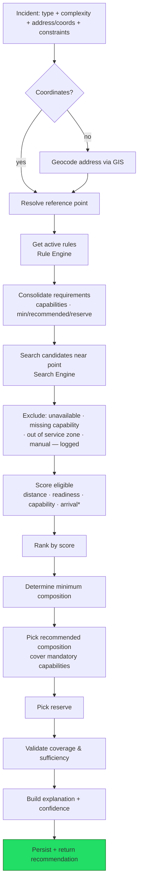
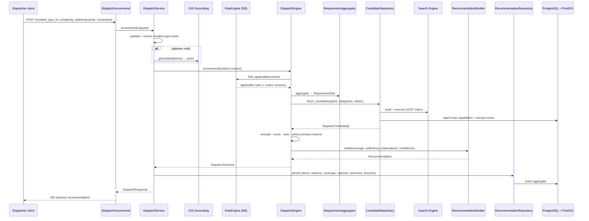
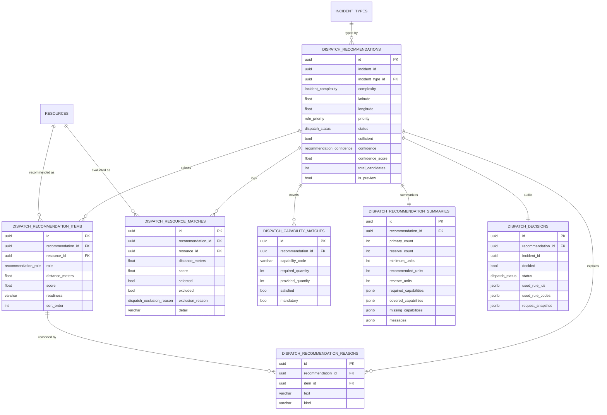
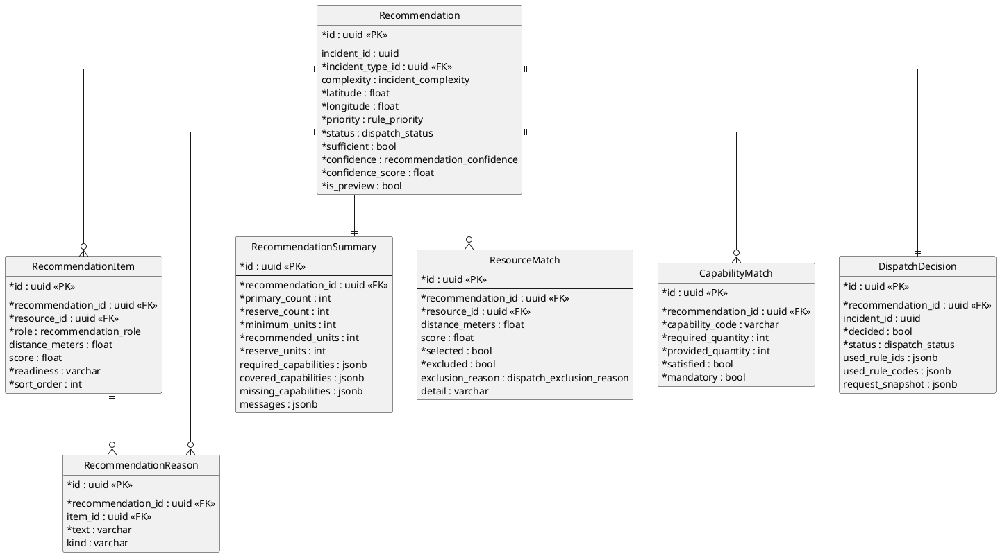

# Dispatch Engine (Stage 6)

The central decision-support module (`backend/app/dispatch/`). Given an incident
(type, complexity, location and optional dispatcher constraints) it forms a
**recommended composition of forces and equipment** — primary units, reserves, a
capability-coverage report and an automatic explanation for every choice — and
persists it for later retrieval and history.

It **reuses existing services without changing them**: norms come from the
database **Rule Engine** (Stage «Rule Management»), candidates from the **Search
Engine** (Stage «Resource Search»), and locations from **GIS geocoding**.

> **Advisory only.** The engine never sends units, builds routes, computes ETA,
> reads traffic, shows a map or uses AI. It proposes the optimal option; the
> dispatcher decides.

## What changed at this stage

Dispatch norms are no longer embedded in the module. The engine obtains
**requirements, constraints, minimum / recommended composition and required
capabilities exclusively via the Rule Engine** and selects **by capability**, not
by unit name. Recommendations, their explanations and the full evaluation log are
**persisted**.

## Module layout

```
backend/app/dispatch/
├── engine.py             # DispatchEngine — the 12-step pipeline coordinator
├── config.py             # DispatchConfig (scoring weights, exclusion policy) — policy, not norms
├── eta.py                # ETAProvider interface + NullETAProvider (routing seam)
├── requirements/         # RequirementAggregator → consolidated RequirementSet
├── algorithms/
│   ├── candidate.py          # DispatchCandidate (resource + distance + caps + zones)
│   ├── scoring.py            # Scorer + RecommendationScore (configurable weights)
│   ├── capability_analyzer.py# CapabilityAnalyzer (required caps, coverage)
│   ├── priority_resolver.py  # PriorityResolver (incident priority, ranking)
│   ├── resource_selector.py  # ResourceSelector (primary composition, via strategy)
│   ├── reserve_selector.py   # ReserveSelector (reserves)
│   └── coverage_validator.py # CoverageValidator (sufficiency verdict + messages)
├── strategies/           # SelectionStrategy interface + GreedyCapabilitySelectionStrategy
├── recommendations/      # domain models + RecommendationBuilder (explanation, confidence)
├── repositories/         # CandidateRepository (Search Engine) + RecommendationRepository
├── models/               # SQLAlchemy: 7 persistence tables + enums
├── schemas/              # Pydantic request/response
├── validators/           # DispatchValidator
├── services/             # DispatchService (orchestration, persistence, history)
├── utils/                # readiness classification, domain↔ORM↔schema mapping
└── deps.py · router.py · api/dispatch.py
```

## Named components

| Component | Responsibility |
|-----------|----------------|
| `DispatchEngine` | Coordinates the whole pipeline for one incident. |
| `DispatchService` | Validates, geocodes, runs the engine, persists, serves retrieval/history. |
| `RequirementAggregator` | Consolidates the applicable rules into one `RequirementSet`. |
| `CapabilityAnalyzer` | Determines required capabilities and measures coverage. |
| `ResourceSelector` | Picks the primary composition (delegates to a `SelectionStrategy`). |
| `ReserveSelector` | Picks reserve units from the remaining candidates. |
| `CoverageValidator` | Decides sufficiency (mandatory capabilities + minimum units). |
| `PriorityResolver` | Resolves incident priority and ranks candidates. |
| `RecommendationBuilder` | Assembles the recommendation, confidence and explanations. |
| `DispatchValidator` | Validates the request (location present, self-consistent). |
| `ETAProvider` | **Interface only** — routing / ETA is a later stage. |

## Decision flow



`*` arrival time is scored only when an `ETAProvider` returns a value — a seam for
the routing stage; today the null provider is wired in and it contributes nothing.

## Sequence



## Capability-driven selection

Selection is by **capability**, never by unit name. The rules state which
capabilities an incident needs (`fire_suppression`, `rescue`, `high_altitude`,
`hazmat`, `water_supply`, `lighting`, `extrication`, `evacuation`,
`radiation_control`, `gdzs`, …). Adding a new capability needs **no algorithm
change** — only a rule that requires it. `RequirementAggregator` consolidates all
applicable rules:

* **capabilities** — union, strictest `min_quantity`, mandatory wins;
* **per-category counts** — element-wise **max** of min / recommended / reserve;
* **priority** — the highest among the applicable rules.

`GreedyCapabilitySelectionStrategy` takes the top-ranked candidates up to the
recommended count, then **tops up** with any candidate that still covers an unmet
**mandatory** capability. The strategy is pluggable (`SelectionStrategy`).

## Constraints considered

Resource status · readiness · organization · service zone (by administrative
area) · priority · mandatory capabilities · recommended capabilities · minimum
composition · recommended composition · reserve. Dispatcher **manual
constraints** (allowed organizations, excluded resources, radius override,
time-of-day) are honoured and logged.

## Explanation of every decision

Each recommended unit carries an automatically generated rationale, e.g.
*«Основной: подразделение доступно, имеет требуемые возможности
(fire_suppression), на удалении 296 м, соответствует действующим правилам.»* plus
the scoring reasons. Recommendation-level notes summarise covered / missing
capabilities and sufficiency. Excluded resources are logged with a reason
(unavailable status, missing capability, out of service zone, manual exclusion).

## Persistence (ER diagram)

A **Recommendation** is the aggregate root: items (primary + reserve), their
reasons, a 1:1 summary, per-capability matches, the full resource-match log
(selected and excluded, with reasons) and a 1:1 decision (audit log).



### PlantUML



The named domain entities map to these tables as: **Recommendation**,
**RecommendationItem**, **RecommendationReason**, **RecommendationSummary**,
**ResourceMatch**, **CapabilityMatch**, **DispatchDecision**. The `DispatchStatus`
enum (`recommended` / `partial` / `no_resources`) is the recommendation outcome;
`decided` is always `false` — the module advises, the dispatcher decides.

## Logging

Every run records the time of formation (`created_at`), the **rules used**
(`dispatch_decisions.used_rule_ids/codes`), the **resources used** and
**considered** with **exclusion reasons** (`dispatch_resource_matches`), the
capability coverage (`dispatch_capability_matches`), and the final recommendation
(the aggregate). The request itself is snapshotted in `request_snapshot`.

## REST API

| Method & path | Purpose |
|---------------|---------|
| `POST /api/v1/dispatch/recommend` | full recommended composition (advisory) |
| `POST /api/v1/dispatch/preview` | quick preview (no reserves) |
| `GET /api/v1/dispatch/{incident_id}` | latest recommendation for an incident |
| `GET /api/v1/dispatch/history/{incident_id}` | recommendation history for an incident |

Request (`DispatchRequest`): `incident_id`, `incident_type_id`, `complexity`,
`latitude`/`longitude` or `address`, `administrative_area_id`, `danger_level`,
`object_type`, `flags`, and `constraints` (organizations, excluded resources,
radius override, time-of-day). Response (`DispatchResponse` →
`RecommendationResponse`): status, sufficiency, confidence, required capabilities,
primary/reserve units (`RecommendationItem`), capability coverage, the
resource-match log (`ResourceMatchResponse`), a summary, messages and reasons.

## ETA seam (next stage)

`ETAProvider` is an interface only; `NullETAProvider` is wired in and returns no
estimate, so the arrival sub-score is inactive. The next stage plugs a real
routing/ETA service into this seam without changing the engine or scoring.

## Constraints (what this stage does **not** do)

No routing, no arrival-time calculation, no traffic, no map, no AI, and **no
automatic dispatch**. The module only recommends and stores; the dispatcher makes
the final decision.

## Tests

- **Unit** (`tests/dispatch/test_unit.py`, no DB): requirement aggregation,
  capability analysis, scoring, greedy selection, coverage validation, priority
  resolution, request validation, and the exclusion rules (availability,
  capability, service zone, manual).
- **Integration** (`tests/dispatch/test_engine_pg.py`, PostgreSQL): full pipeline —
  selection, mandatory-capability coverage, busy-resource exclusion with reason,
  reserves, preview, persistence and history, manual organization constraint.
- **API** (`tests/dispatch/test_api_pg.py`, PostgreSQL): recommend, preview, get,
  history and request validation over the REST surface.

PostgreSQL-backed tests skip automatically when no database is reachable.
