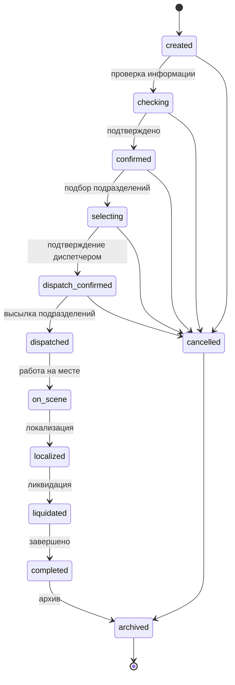
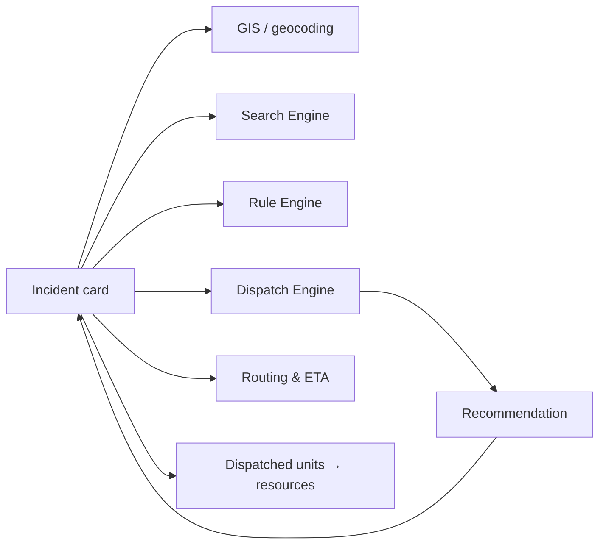
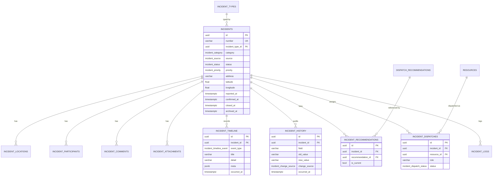
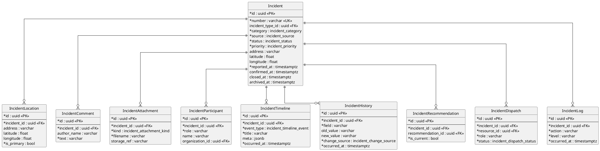

# Incident Management (Stage 9)

The **incident card is the central entity of the whole system** — every other
subsystem (GIS, Search, Rules, Dispatch, Routing, Recommendation) relates to an
incident. This module (`backend/app/incidents/`) owns an incident's full
lifecycle, its **timeline**, its field-level **history**, its **comments**,
**attachments** (metadata), and its links to **recommendations** and
**dispatched units**.

It reuses existing services and catalogs unchanged (incident types,
administrative areas, organizations, resources, dispatch recommendations); no
earlier stage is modified.

## Module layout

```
backend/app/incidents/
├── models/           # SQLAlchemy: 10 tables + enums + shared enum types
├── validators/       # the lifecycle state machine (allowed transitions)
├── repositories/     # IncidentRepository (eager loads, active/archive listings)
├── timeline/         # TimelineRecorder (chronology)
├── history/          # HistoryRecorder (field-level audit: who/when/old→new/source)
├── attachments/      # AttachmentService (metadata architecture — no binaries yet)
├── utils/            # Actor, IncidentLogger, ORM→schema mapping
├── services/         # IncidentService (create/update/status/assign/close/archive)
├── schemas/          # Pydantic Create/Update/Response, Status, Timeline, Comment
└── deps.py · router.py · api/incidents.py
```

## Entities

| Table | Purpose |
|-------|---------|
| `incidents` | The central card: number, type, category, source, **status**, priority, location, reporter, lifecycle timestamps. |
| `incident_locations` | Geocoded / historical location records (the primary one mirrors the card). |
| `incident_participants` | People/organizations related to the incident. |
| `incident_comments` | Dispatcher comments (also mirrored on the timeline). |
| `incident_attachments` | Attachment **metadata** (kind, filename, size, `storage_ref`) — architecture only. |
| `incident_timeline` | Chronology of what happened (human-facing). |
| `incident_history` | Field-level audit: field, old → new, source, who, when. |
| `incident_recommendations` | Links to Dispatch-Engine recommendations. |
| `incident_dispatches` | Units assigned / dispatched (reference `resources`). |
| `incident_logs` | Technical/system log entries. |

Enums (native PostgreSQL): `incident_status`, `incident_priority`,
`incident_category`, `incident_source`, `incident_timeline_event`,
`incident_change_source`, `incident_dispatch_status`, `incident_attachment_kind`.

## Lifecycle & state machine

An incident moves through a fixed lifecycle. Transitions are enforced by a finite
state machine (`validators/state_machine.py`); **invalid transitions are
rejected** (HTTP 422). An incident may be **cancelled** only before dispatch;
completed/cancelled incidents may be **archived**.



Each status change records a `status` **history** entry (old → new, actor,
source), a **timeline** `status_changed` event (plus `closed` / `archived`
milestones) and a **log** entry, and sets the relevant timestamp
(`confirmed_at` / `closed_at` / `archived_at`).

## Timeline

The timeline is the chronological, human-facing record. Events are written for:
creation, information checked, confirmation, **address change**, **category
change**, **priority change**, **recommendation requested**, **units assigned**,
**status change**, **comment added**, attachment/participant added, closed and
archived. Each entry has a type, title, optional detail, the actor and a JSONB
`meta`.

## History (audit)

Every change to the card is recorded field-by-field: **field**, **old value**,
**new value**, **change source** (dispatcher / system / integration), **who** and
**when**. `HistoryRecorder.record_changes` skips no-ops so only real changes are
logged.

## Integration with other modules

The incident is the hub. Beyond referencing the catalogs, the service integrates
with the **Dispatch Engine** without changing it: `request_recommendation`
(`POST /incidents/{id}/recommend`) builds a `DispatchRequest` from the incident
and calls the existing `DispatchService`, then links the resulting recommendation
(`incident_recommendations`). Assigned units (`POST /incidents/{id}/units`) are
stored in `incident_dispatches` referencing `resources`.



## ER diagram (Mermaid)



## ER diagram (PlantUML)



## REST API

| Method & path | Purpose |
|---------------|---------|
| `POST /api/v1/incidents` | create an incident |
| `GET /api/v1/incidents` | list incidents (summaries) |
| `GET /api/v1/incidents/active` | active incidents |
| `GET /api/v1/incidents/archive` | closed / archived incidents |
| `GET /api/v1/incidents/{id}` | full incident card |
| `PUT /api/v1/incidents/{id}` | update metadata (audited) |
| `PATCH /api/v1/incidents/{id}/status` | change status (state machine) |
| `GET /api/v1/incidents/{id}/timeline` | the chronology |
| `POST /api/v1/incidents/{id}/comments` | add a comment |
| `POST /api/v1/incidents/{id}/units` | assign / dispatch units *(integration)* |
| `POST /api/v1/incidents/{id}/recommend` | get a recommendation via the Dispatch Engine *(integration)* |

Pydantic schemas: `IncidentCreate`, `IncidentUpdate`, `IncidentResponse`,
`IncidentTimelineResponse`, `CommentResponse`, `StatusResponse` (plus nested
location/participant/attachment/history/dispatch/recommendation responses).

## Logging

Every card change is captured across three complementary records: the
**timeline** (what happened), the **history** (which field changed, old → new,
source, who, when) and the technical **log**. Together they make an incident
fully reconstructable.

## Constraints

No telephony, speech recognition, AI, admin panel or external-system exchange —
this stage delivers only a complete incident-management module. It leaves seams
for the next stage (IP telephony, automatic incident creation from an incoming
call, speech transcription, automatic field population, AI assistant) to plug in
**without changing** this module.

## Tests

- **Unit** (`tests/incidents/test_state_machine.py`): the full lifecycle path,
  rejected invalid jumps, cancel-before-dispatch, terminal states, active/closed
  partition.
- **Integration** (`tests/incidents/test_service_pg.py`, PostgreSQL): creation
  (timeline + primary location), field-level history on update, valid status
  progression, rejected invalid transition, comments + unit assignment
  (de-duplicated), the Dispatch-Engine recommendation link, active/archive
  listing.
- **API** (`tests/incidents/test_api_pg.py`, PostgreSQL): create/get, update +
  history, valid & invalid status changes, timeline + comments, unit assignment +
  recommendation, active/archive endpoints.

PostgreSQL-backed tests skip automatically when no database is reachable.
