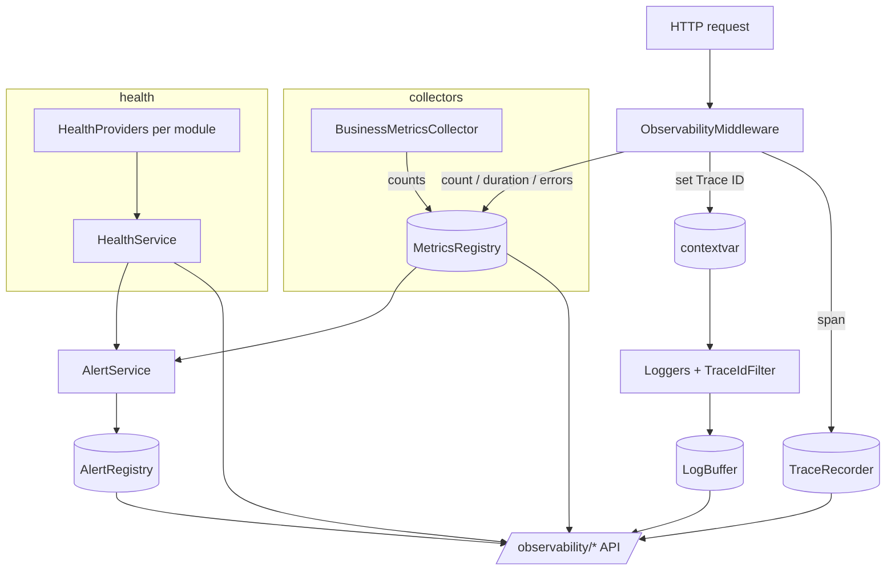

# Observability Platform (Stage 14)

This module (`backend/app/observability/`) provides **monitoring, logging and
observability** for the whole system: real-time control of every component's
state and the means to diagnose it — health checks, technical metrics, centralized
structured logging, request tracing and alert-event generation, exposed through a
single Dashboard API.

It is **backend-agnostic** (not tied to Prometheus / Grafana / OpenTelemetry /
ELK), observes the existing modules **without changing their business logic**, and
needs **no new database tables** — signals are collected in-process and business
gauges are read straight from existing tables.

## Module layout

```
backend/app/observability/
├── health/       # HealthProvider interface + per-module adapters + aggregation
├── metrics/      # in-memory MetricsRegistry (counters / gauges / histograms)
├── logging/      # LoggingService (6 levels) + LogBuffer + Trace-ID filter
├── tracing/      # Trace ID context (contextvars) + recent-span recorder
├── alerts/       # AlertService (rules → events, no delivery)
├── collectors/   # business-metric collectors (read existing tables)
├── exporters/    # exporter interface + JSON / Prometheus-text formatters
├── dashboards/   # DashboardService (aggregated status)
├── services/     # HealthService · MetricsService · DashboardService
├── schemas/      # Pydantic responses
├── utils/        # masking, ring buffer
├── middleware.py # ObservabilityMiddleware (Trace ID + request metrics/traces)
├── state.py      # process-wide singletons (registry, recorder, buffer, alerts)
└── deps.py · router.py · api/observability.py
```

## Observability flows



## HealthProvider (stage §2)

Every subsystem exposes its state through one interface:

```python
class HealthProvider(ABC):
    async def readiness() -> bool     # dependencies reachable?
    async def liveness()  -> bool     # process/module alive?
    def version()         -> str
    async def health()    -> ComponentHealth   # full snapshot
```

Existing modules are **not modified**: the platform supplies a `HealthProvider`
**adapter** per module — DB-table-backed (the module's main table is reachable),
provider-backed (reuses an existing `health_check`, e.g. telephony / AI) or
stateless. `HealthService` runs all probes concurrently and aggregates them
(overall = worst component). Endpoints: `GET /observability/health`,
`/health/live` (liveness), `/health/ready` (readiness).

Components covered: `database`, `gis`, `search`, `rules`, `dispatch`,
`incidents`, `resources`, `calls`, `admin`, `ai`, `routing`, `telephony`,
`ai_providers`.

## Metrics (stage §3)

A backend-agnostic in-memory `MetricsRegistry` holds **counters**, **gauges** and
**histograms** — not tied to any monitoring system; an exporter renders a snapshot
into JSON or Prometheus text (or, later, OpenTelemetry) with **no change to
instrumentation**. The minimum set:

| Metric | Source |
|--------|--------|
| requests count, error %, API response time (p95 / avg / max) | request middleware |
| service uptime | process start time |
| active users, queue size | business collectors |
| active incidents, active calls, available units | business collectors |

`GET /observability/metrics` (JSON) and `GET /observability/metrics/prometheus`
(text). Business gauges are refreshed on read by counting existing tables — no
business logic is duplicated.

## Centralized logging (stage §4)

`LoggingService` gives every subsystem the same six levels — **TRACE / DEBUG /
INFO / WARNING / ERROR / CRITICAL** — a consistent **structured** format,
automatic **Trace ID** correlation and **masking** of sensitive fields. A
`LogBuffer` handler keeps recent structured entries for `GET /observability/logs`
(filter by level / trace id). It wraps stdlib logging — no external dependency.

## Trace ID (stage §5)

Each request is assigned a unique **Trace ID** (reused from an inbound
`X-Trace-ID` / `X-Request-ID` header or generated), bound to a `contextvars`
context so it flows through **all internal services**, stamped onto **every log
record** by a filter, attached to each **trace span**, and echoed back on the
response `X-Trace-ID` header. `GET /observability/traces` returns recent spans.

## Alerts (stage §6)

`AlertService` evaluates rules against the current health and metrics and
**generates alert events** — it does **not send** notifications (real delivery /
SIEM is a later concern). Rules:

- **service unavailable** — a component is `unhealthy` (critical);
- **health-check failed** — a component is `degraded` (warning);
- **error rate high** — 5xx / total above a threshold (critical);
- **response time high** — request p95 above a threshold (warning);
- **queue overflow** — call-queue size above a threshold (warning).

`GET /observability/alerts` (re-evaluates by default) returns recent events.

## Security (stage §10)

Logs, metrics and traces never contain passwords, secrets, access keys,
unnecessary personal data or full conversation texts. A **masking** layer
(`utils/masking.py`) scrubs sensitive keys (`password`, `token`, `secret`,
`api_key`, `authorization`, `session_token`, …) wholesale and **truncates** long
/ personal text fields (`text`, `transcript`, `prompt`, …) before anything is
recorded.

## REST API (stage §7)

| Method & path | Purpose |
|---------------|---------|
| `GET /api/v1/observability/health` | aggregated health of all components |
| `GET /api/v1/observability/health/live` · `/health/ready` | liveness / readiness probes |
| `GET /api/v1/observability/metrics` | metrics (JSON) |
| `GET /api/v1/observability/metrics/prometheus` | metrics (Prometheus text) |
| `GET /api/v1/observability/logs` | recent structured logs (filterable) |
| `GET /api/v1/observability/traces` | recent request traces |
| `GET /api/v1/observability/alerts` | alert events (re-evaluated) |
| `GET /api/v1/observability/status` | aggregated dashboard (health + key metrics + alerts) |

Pydantic schemas (stage §8): `HealthResponse` (+ `ComponentHealthResponse`),
`MetricResponse`, `TraceResponse`, `AlertResponse`, `LogEntryResponse`,
`DashboardResponse`.

## Integration (stage §9)

The `ObservabilityMiddleware` (registered in the app factory, wrapping the
existing request-context middleware) provides Trace ID, request metrics and traces
for **every** endpoint of **every** module, and the `TraceIdFilter` + `LogBuffer`
give every existing logger correlation and central capture — all **without
changing any module's code**. Health and business metrics are adapters/collectors
over the existing modules. No business logic is duplicated.

## Constraints

Not tied to any specific product (Prometheus / Grafana / OpenTelemetry / ELK); no
real notifications are sent (events only); no existing business logic is changed.

## Next-stage readiness

The exporter and collector seams accommodate Prometheus, Grafana, OpenTelemetry,
ELK / OpenSearch, external alerting and SIEM systems. The next stage (analytics /
reporting / KPI) will **consume** this platform's data without replacing it.

## Tests

- **Unit** (`tests/observability/test_unit.py`): masking (sensitive keys + text
  truncation), the ring buffer, the metrics registry (counters / gauges /
  histograms / p95), the Trace-ID context, the log buffer (capture + masking +
  trace id), and the alert rules (all five fire; quiet when healthy).
- **Integration** (`tests/observability/test_service_pg.py`, PostgreSQL):
  `HealthService` reports every component (database healthy), `MetricsService`
  collects the business gauges + uptime, `DashboardService` aggregates the status.
- **API** (`tests/observability/test_api_pg.py`, PostgreSQL): health + liveness +
  readiness, metrics (JSON + Prometheus), **Trace ID propagation** (header echoed
  and the span recorded), traces, logs, alerts and the status dashboard.

PostgreSQL-backed tests skip automatically when no database is reachable.
