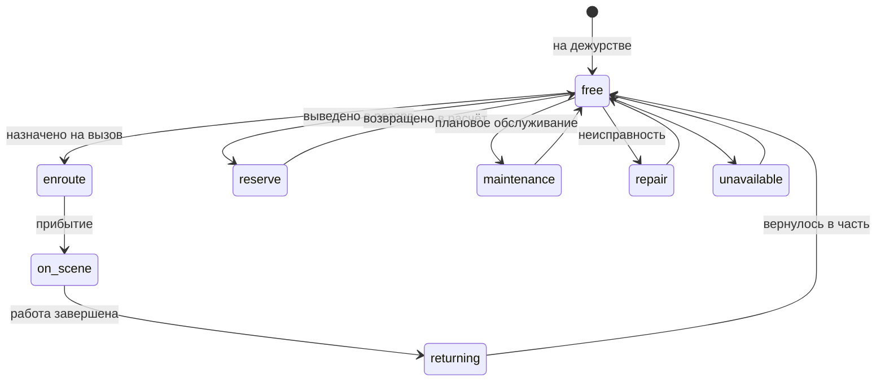
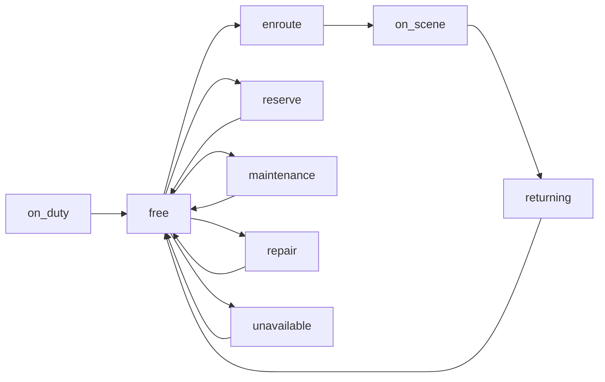
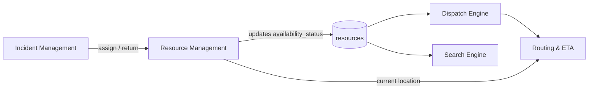
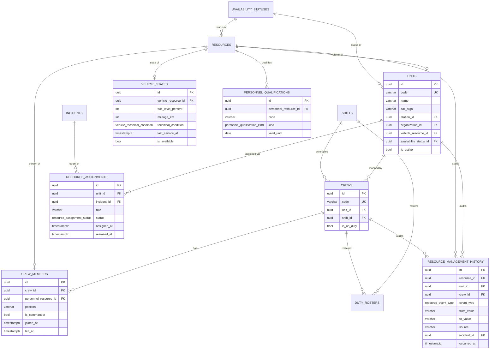
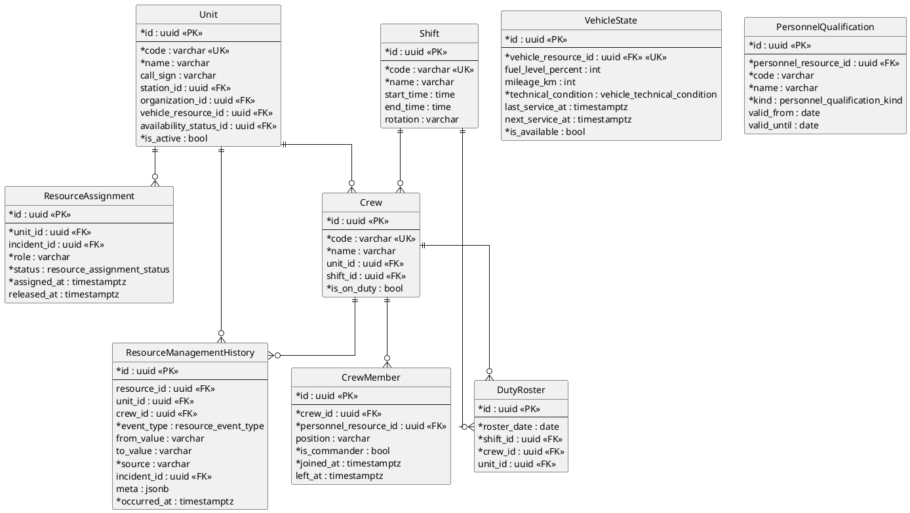

# Real-time Resource / Unit Management (Stage 10)

This module (`backend/app/resources/`) keeps the **live operational state** of
every dispatchable **unit** (отделение / расчёт), its **vehicle**, its **crew**
and **personnel**: current status, crew composition, incident assignments,
per-vehicle condition (fuel, mileage, service) and an **append-only history** of
every change.

It is built **on top of** the Stage-2 resource model, which it never modifies.
Vehicles, personnel and stations are the existing `resources` rows (and their
`vehicles` / `personnel` sub-type rows); statuses are the existing
`availability_statuses` **catalog** (data, not code). The module only adds the
new *operational* concepts (units, crews, shifts, rosters, assignments,
per-vehicle state, qualifications, history) around them.

> **Dispatch integration without touching the Dispatch Engine.** A status change
> here updates the underlying `resources.availability_status` that the Dispatch
> Engine already reads — so the engine always uses this module's current data,
> and no engine code (or any earlier stage) is changed.

## Module layout

```
backend/app/resources/
├── models/          # SQLAlchemy: 9 operational tables + enums + shared enum types
├── tracking/        # PositionProvider interface + StoredPositionProvider (no GPS)
├── repositories/    # ResourceManagementRepository (eager loads, no N+1)
├── services/        # ResourceManagementService (status/crew/assignment/history)
├── schemas/         # Pydantic request / response models
├── utils/           # ORM → schema mapping
├── history/         # append-only change history (see ResourceManagementHistory)
├── notifications/   # (seam) hook point for future push / WebSocket fan-out
├── validators/      # (seam) status / composition rules
└── deps.py · router.py · api/resources.py
```

## Entities

| Table | Purpose |
|-------|---------|
| `units` | A dispatchable operational unit: ties a station, a vehicle (`resources`) and its crews together; carries its own current **status** (from the availability catalog). |
| `shifts` | Duty-shift templates (смена): start/end time, rotation. |
| `crews` | A crew (караул / экипаж) — the people currently manning a unit; on-duty flag. |
| `crew_members` | A person on a crew, referencing a Stage-2 personnel `resource`; position, commander flag, join/leave timestamps. |
| `duty_rosters` | Which crew mans which shift on a given date. |
| `resource_assignments` | A unit's assignment to an incident (role, status, assigned/released timestamps). |
| `vehicle_states` | Per-vehicle operational state: fuel %, mileage, technical condition, last / next service, availability. Extends the Stage-2 `vehicles` row without modifying it. |
| `personnel_qualifications` | Personnel qualification / clearance / (future) medical restriction: code, name, kind, validity window. |
| `resource_management_history` | **Append-only** history of unit / vehicle / personnel status changes, crew changes, and incident assignment / return — with actor, source, old → new value, related incident. |

Enums (native PostgreSQL): `vehicle_technical_condition`
(operational / needs_service / under_repair / decommissioned),
`personnel_qualification_kind` (qualification / clearance / medical),
`resource_assignment_status` (active / released / cancelled),
`resource_event_type` (unit / vehicle / personnel status changed, crew changed,
crew member changed, assigned, returned).

### Statuses are data, not code

The 9 minimum statuses live in the shared `availability_statuses` catalog and are
seeded by the migration — they can be added / edited **without code changes**:

| Code | Name | Operational | Dispatchable |
|------|------|:-----------:|:------------:|
| `on_duty` | В боевом расчёте | ✓ | ✓ |
| `free` | Свободно | ✓ | ✓ |
| `enroute` | Следует к месту вызова | ✓ | – |
| `on_scene` | Работает на месте | ✓ | – |
| `returning` | Возвращается | ✓ | – |
| `maintenance` | На обслуживании | – | – |
| `repair` | На ремонте | – | – |
| `unavailable` | Недоступно | – | – |
| `reserve` | Резерв | ✓ | – |

`is_available_for_dispatch` is what the Dispatch Engine filters on.

## Position provider (no GPS)

Coordinates come through a pluggable `PositionProvider` interface
(`tracking/position_provider.py`), so a real telemetry / GPS source can be
swapped in later **without changing callers**. The only implementation now is
`StoredPositionProvider`, which reads the last-known `latitude` / `longitude`
already stored on the Stage-2 `resources` row. **No GPS, telemetry or external
tracking is implemented** in this stage.

## Unit lifecycle



## Status transitions

Statuses are catalog rows, so **any transition is technically allowed** (the
`validators/` package is the seam for future business rules). The typical
operational flow is:



Every transition writes both the shared `status_history` (so it is visible to the
rest of the system) **and** this module's `resource_management_history`, with the
time, actor, source, old status, new status and related incident.

## Integration with the Dispatch Engine (and other modules)



* **Dispatch Engine / Search Engine** — read `resources.availability_status`.
  Updating a unit or vehicle status here propagates to that column, so both see
  current data. **No Dispatch algorithm is modified.**
* **Incident Management** — `resource_assignments` links a unit to an incident
  (assign / return), complementing Stage-9's `incident_dispatches`.
* **Routing Engine** — consumes the current location via the `PositionProvider`.
* **Dispatcher Workspace** — consumes the REST endpoints below. Reads are
  optimized (eager `selectinload`, no N+1) and bulk status updates use a single
  `UPDATE`; the service is structured so a future WebSocket layer can fan out
  changes (**WebSocket is intentionally not implemented** — see the
  `notifications/` seam).

## ER diagram (Mermaid)



## ER diagram (PlantUML)



## REST API

| Method & path | Purpose |
|---------------|---------|
| `GET /api/v1/units` | list units |
| `GET /api/v1/units/{id}` | get one unit |
| `PATCH /api/v1/units/{id}/status` | change unit status (propagates to the vehicle resource) |
| `POST /api/v1/units/{id}/crew` | assign a crew to the unit *(integration)* |
| `POST /api/v1/units/{id}/assign` | assign the unit to an incident *(integration)* |
| `POST /api/v1/units/{id}/return` | return the unit from the incident *(integration)* |
| `GET /api/v1/units/{id}/location` | current unit location (via `PositionProvider`) |
| `GET /api/v1/vehicles` | list vehicles (with operational state) |
| `GET /api/v1/vehicles/{id}` | get one vehicle |
| `PATCH /api/v1/vehicles/{id}/status` | change vehicle status |
| `GET /api/v1/crews` | list crews (with members) |
| `POST /api/v1/crews/{id}/composition` | change crew composition (add / remove) *(integration)* |
| `GET /api/v1/personnel` | list personnel (with qualifications) |
| `PATCH /api/v1/personnel/{id}/status` | change personnel status |
| `POST /api/v1/resources/bulk-status` | fast bulk status update |
| `GET /api/v1/resources/status` | status overview (count per status) |
| `GET /api/v1/resources/history` | change history (filter by resource / unit) |

> The literal `/resources/status` and `/resources/history` routes are registered
> **before** the Search module's dynamic `/resources/{resource_id}` so they are
> not shadowed.

Pydantic schemas: `UnitResponse`, `VehicleResponse`, `CrewResponse`,
`PersonnelResponse`, `AssignmentResponse`, `StatusOverviewItem`,
`HistoryEntryResponse`, and the request models `StatusUpdateRequest`,
`AssignCrewRequest`, `CrewCompositionChange`, `AssignIncidentRequest`,
`BulkStatusUpdateRequest`.

## Logging / history

Every status or composition change is captured in
`resource_management_history` with the **time**, **actor**, **old value → new
value**, **change source** and the **related incident** — and is **never
deleted**. Status changes additionally write the shared `status_history` so the
change is visible to the rest of the system.

## Performance

* Reads use eager `selectinload` (no N+1); the existing-model relationships are
  `lazy="raise"` to catch accidental lazy loads.
* `bulk_update_status` performs a single `UPDATE ... WHERE id IN (...)` plus
  batched history rows.
* Indexed history (`occurred_at`, `resource_id`, `unit_id`) for fast timelines.
* The service is WebSocket-ready (a `notifications/` seam) but **WebSocket is not
  implemented** in this stage.

## Constraints

Per the stage brief, this module deliberately does **not** implement: GPS
tracking, WebSocket streaming, telemetry, external-system exchange, or AI. It
**does not modify** the Dispatch Engine algorithms or the architecture of any
previous stage — all new services reuse the existing models and API. It also
leaves seams for the next stage (IP telephony, call queue, automatic incident
creation from a call, speech transcription, AI assistant) to plug in without
changing this module.

## Tests

- **Unit** (`tests/resources/test_mapping.py`): status-ref flag mapping, unit
  availability following its status (+ crew count, active assignment), vehicle
  response drawing from the operational state.
- **Integration** (`tests/resources/test_service_pg.py`, PostgreSQL): unit status
  change **propagating to the vehicle resource** the Dispatch Engine reads,
  vehicle status change + history, bulk update, crew assignment + composition
  change, incident assign / return, append-only history, availability check,
  location, status overview.
- **API** (`tests/resources/test_api_pg.py`, PostgreSQL): list/get units,
  vehicles, crews, personnel; unit & vehicle status changes (incl. propagation);
  unknown status → 422; status overview; history.

PostgreSQL-backed tests skip automatically when no database is reachable.
