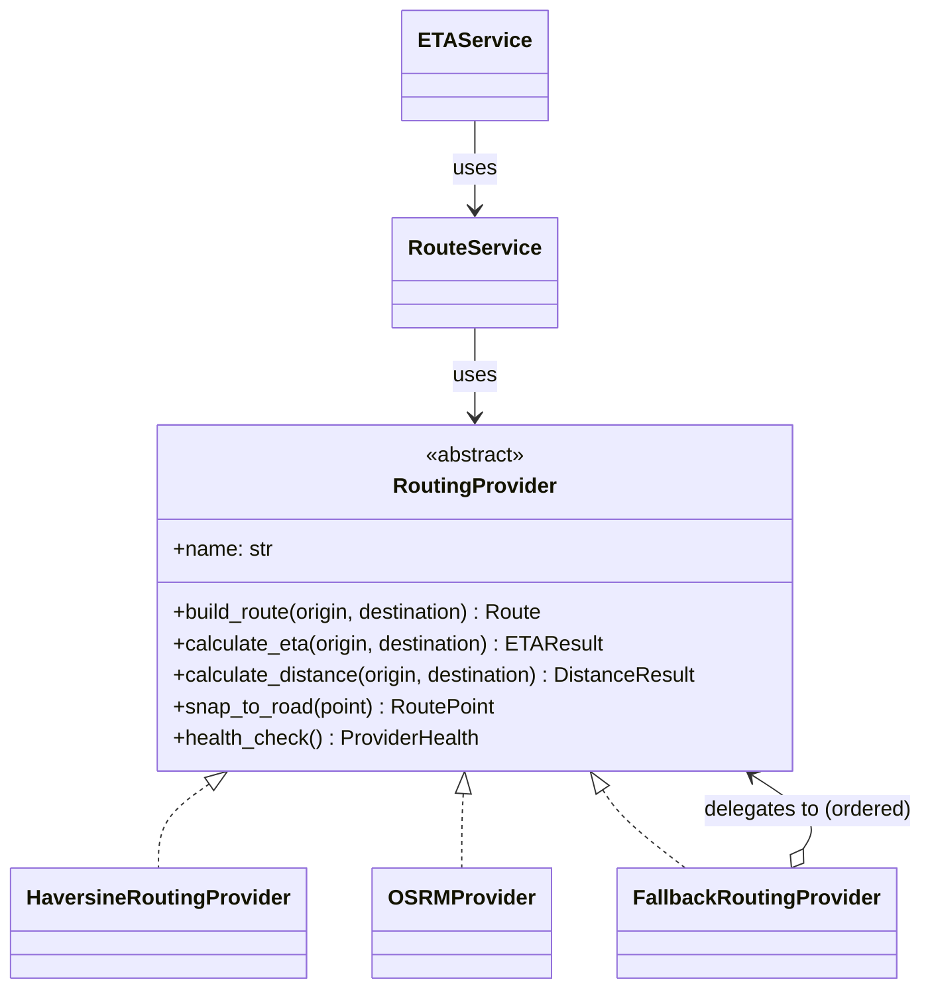

# Routing & ETA (Stage 7)

An independent module (`backend/app/routing/`) that builds routes, computes travel
distance and estimates **time of arrival (ETA)** between two points. It exposes a
single **`RoutingProvider`** seam so any routing backend can be plugged in through
configuration, and a small set of services the rest of the system depends on.

The **Dispatch Engine obtains arrival times through this module's `ETAService`**
— it never talks to a routing backend directly. This stage does **not** modify the
Dispatch Engine; it only provides the module and the interface it will use.

> **Out of scope (by requirement):** no traffic, no temporary road closures, no
> AI, no automatic dispatch. Distance/ETA are computed from geometry and an
> average speed; a real router (OSRM) refines them when configured.

## Module layout

```
backend/app/routing/
├── interfaces/
│   └── routing_provider.py   # RoutingProvider ABC + RoutingError / ProviderUnavailableError
├── models/
│   └── domain.py             # Route, RouteSegment, RoutePoint, ETAResult,
│                             #   DistanceResult, RoutingRequest, RoutingResponse, ProviderHealth
├── providers/
│   ├── haversine.py          # HaversineRoutingProvider (offline default estimator)
│   ├── osrm.py               # OSRMProvider (HTTP)
│   └── fallback.py           # FallbackRoutingProvider (resilient provider chain)
├── services/
│   ├── route_service.py      # RouteService (build / distance / geometry / waypoints)
│   └── eta_service.py        # ETAService (ETA only — used by the Dispatch Engine)
├── repositories/
│   └── route_cache.py        # RouteCache ABC + InMemoryRouteCache (Redis-ready, no Redis yet)
├── schemas/                  # Pydantic request/response
├── utils/                    # great-circle math, domain→schema mapping
├── config.py                 # RoutingConfig (provider choice, speed, cache)
└── deps.py · router.py · api/routing.py
```

## RoutingProvider — the single seam

Every backend implements one interface, so the services never depend on a
concrete provider (Dependency Inversion). Adding GraphHopper, Valhalla,
OpenRouteService, a commercial API or an in-house router later requires **no
change to the business logic**.



### Providers

| Provider | Role |
|----------|------|
| `HaversineRoutingProvider` | Dependency-free straight-line estimator: great-circle distance × **road factor**, ETA from **average speed**. The default (works with no external server) and the fallback. |
| `OSRMProvider` | Real HTTP routing against an OSRM server (`/route`, `/nearest`). The concrete example backend. |
| `FallbackRoutingProvider` | Ordered chain: tries the primary, falls back to the next when a provider is **unavailable** (marks the result `is_fallback`). |

`create_provider(config)` builds the configured provider: the estimator by
default, or OSRM primary with the estimator as an automatic fallback when
`ROUTING_OSRM_URL` is set.

## RouteService

Coordinates the provider and the route-reuse cache. Functions:

- **build a route** — full geometry, segments, distance, duration;
- **calculate distance** and **calculate ETA**;
- **get geometry** and **get control points (waypoints)**;
- **snap to road** and **health**.

It records structured logs (**provider, response time, distance, ETA, errors**)
and turns provider failures into clear, catchable errors so a routing outage never
crashes the caller.

## ETA Service

`ETAService` is responsible **only** for ETA and is the entry point the Dispatch
Engine uses. It delegates to `RouteService`/the provider and also offers a
distance-only fallback (`eta_seconds_for_distance`) matching the shape of the
Dispatch Engine's `ETAProvider.estimate(distance_meters)` seam — a thin adapter
can plug this service into the Dispatch Engine with **no change to either module**.

## Error handling & resilience

- A backend that is unreachable/❯500 raises `ProviderUnavailableError`; a bad or
  routeless response raises `RoutingError`.
- `FallbackRoutingProvider` masks **unavailability** (not "no route") by moving to
  the next provider, so the Dispatch Engine keeps working when OSRM is down.
- The REST layer maps `ProviderUnavailableError → 503` and `RoutingError → 422`.

## Performance

Routes between the same two points are cached (`RouteCache`) for reuse. The
default `InMemoryRouteCache` is a TTL + LRU store; the interface is **Redis-ready**
so a distributed cache can be added later without touching the services (Redis is
**not** connected at this stage).

## REST API

| Method & path | Purpose |
|---------------|---------|
| `GET /api/v1/routing/route` | build a route (query: `from_lat,from_lon,to_lat,to_lon,profile,alternatives`) |
| `POST /api/v1/routing/eta` | estimated time of arrival |
| `POST /api/v1/routing/distance` | travel distance |
| `GET /api/v1/routing/health` | routing provider health |

### Examples

**Build a route**

```
GET /api/v1/routing/route?from_lat=55.7539&from_lon=37.6208&to_lat=55.7887&to_lon=37.6009
```

```json
{
  "origin": {"latitude": 55.7539, "longitude": 37.6208, "name": "origin", "is_waypoint": true},
  "destination": {"latitude": 55.7887, "longitude": 37.6009, "name": "destination", "is_waypoint": true},
  "distance_meters": 5083.2,
  "distance_km": 5.083,
  "duration_seconds": 366.0,
  "eta_minutes": 6.1,
  "provider": "haversine",
  "profile": "driving",
  "is_fallback": false,
  "response_time_ms": 0.3,
  "waypoints": [{"latitude": 55.7539, "longitude": 37.6208, "name": "origin", "is_waypoint": true},
                {"latitude": 55.7887, "longitude": 37.6009, "name": "destination", "is_waypoint": true}],
  "segments": [{"distance_meters": 5083.2, "duration_seconds": 366.0}],
  "geometry": [{"latitude": 55.7539, "longitude": 37.6208, "name": "origin", "is_waypoint": true},
               {"latitude": 55.7887, "longitude": 37.6009, "name": "destination", "is_waypoint": true}]
}
```

**Estimate ETA**

```
POST /api/v1/routing/eta
{
  "origin": {"latitude": 55.7539, "longitude": 37.6208},
  "destination": {"latitude": 55.7887, "longitude": 37.6009}
}
```

```json
{
  "origin": {"latitude": 55.7539, "longitude": 37.6208},
  "destination": {"latitude": 55.7887, "longitude": 37.6009},
  "eta_seconds": 366.0,
  "eta_minutes": 6.1,
  "distance_meters": 5083.2,
  "provider": "haversine",
  "is_fallback": false
}
```

**Distance**

```
POST /api/v1/routing/distance
{ "origin": {"latitude": 55.7539, "longitude": 37.6208},
  "destination": {"latitude": 59.9343, "longitude": 30.3351} }
```

```json
{ "distance_meters": 823456.0, "distance_km": 823.456, "provider": "haversine", "is_fallback": false, "...": "..." }
```

**Health**

```
GET /api/v1/routing/health
{ "provider": "haversine", "healthy": true, "detail": "in-process", "latency_ms": null }
```

## Configuration

| Setting | Default | Meaning |
|---------|---------|---------|
| `ROUTING_PROVIDER` | `haversine` | `haversine` or `osrm` |
| `ROUTING_OSRM_URL` | `null` | OSRM base URL; enables OSRM (+ estimator fallback) |
| `ROUTING_AVERAGE_SPEED_KMH` | `50` | speed for straight-line ETA |
| `ROUTING_ROAD_FACTOR` | `1.3` | detour factor over great-circle distance |
| `ROUTING_ENABLE_FALLBACK` | `true` | fall back to the estimator when OSRM is down |
| `ROUTING_CACHE_*` | memory / 120 s / 2000 | route-reuse cache (Redis-ready) |

## Next stage (dispatcher workstation)

The module is shaped for the UI stage: route geometry and control points (for
map display), ETA and distance, and support for multiple recommended units and
**alternative routes** (`alternatives=true`). No UI is built here.

## Tests

- **Unit** (`tests/routing/test_unit.py`): great-circle math, the Haversine
  provider (distance/ETA/road-factor/route/health), the route cache, `RouteService`
  cache reuse, `ETAService`, and provider **fallback** on outage.
- **OSRM** (`tests/routing/test_osrm.py`): OSRM payload parsing (route, ETA,
  distance, snap, health) and error mapping (server error / network error →
  `ProviderUnavailableError`; no-route → `RoutingError`) via a mocked HTTP
  transport — no real server needed.
- **API** (`tests/routing/test_api.py`): route, ETA, distance and health
  endpoints, coordinate validation (422) and provider-unavailable (503).
