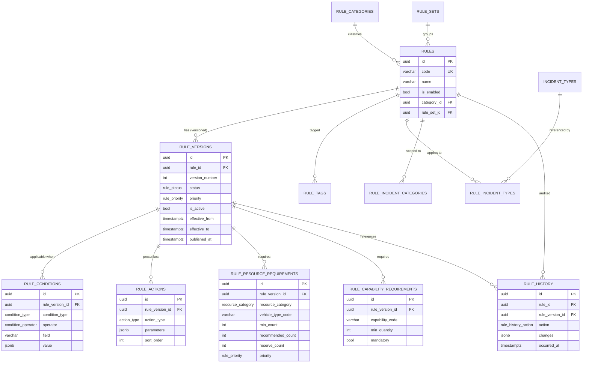
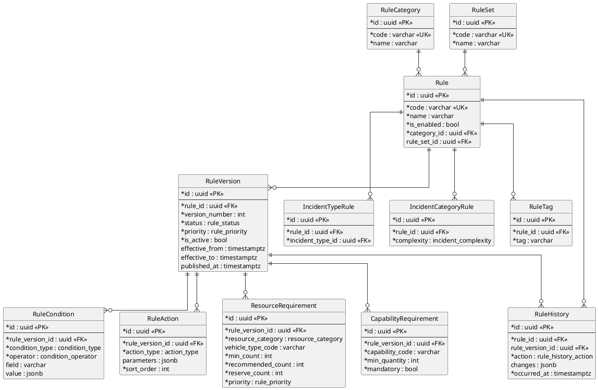
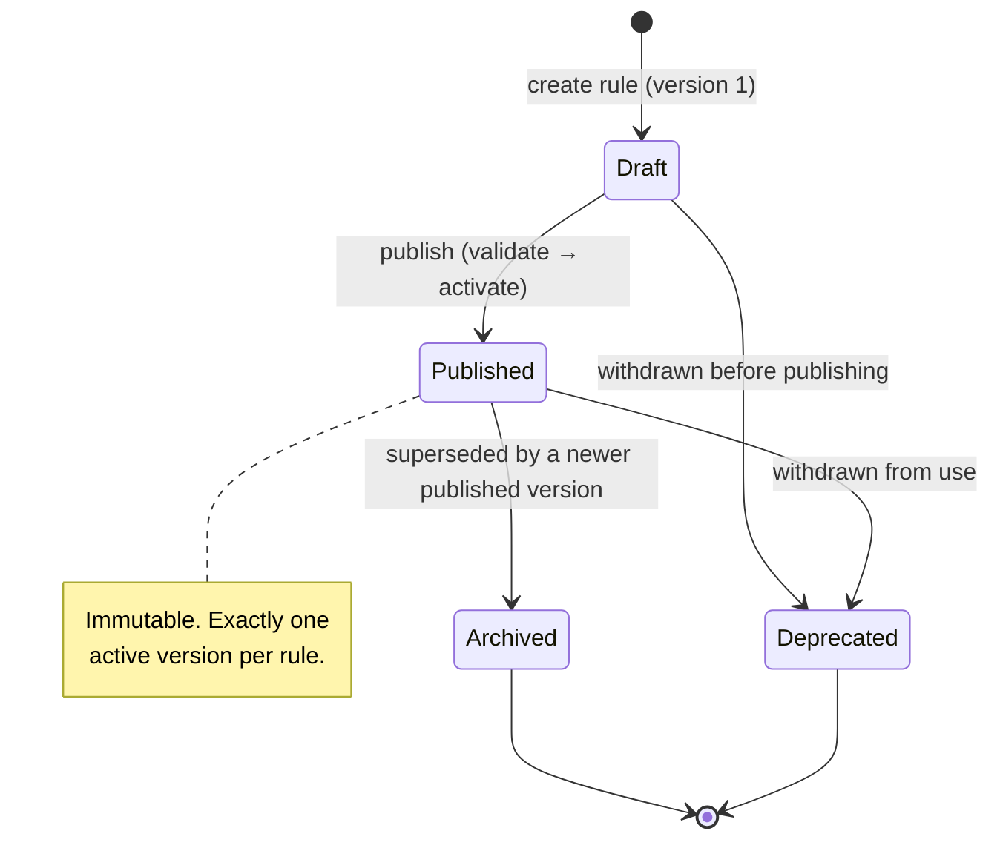
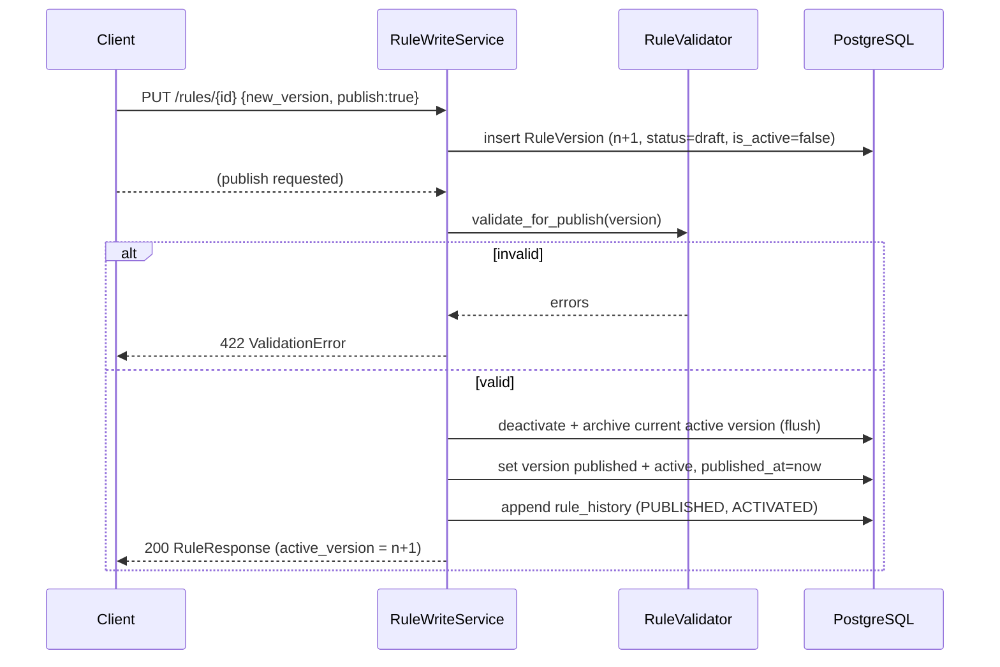

# Rule Infrastructure (Stage 6)

A **universal, database-backed, versioned** store of dispatch norms
(`backend/app/rules/`). Rules live in the database — never in code — and every
algorithm obtains them through a single **Rule Engine / `RuleService`**. This
stage delivers only the *infrastructure*: it finds rules, checks their
conditions, decides which apply and returns ready-made requirements. It selects
no concrete units, builds no routes, uses no AI and makes no dispatch decisions.

> **Why in the database?** Norms change (new categories of incidents, revised
> minimum compositions, seasonal rules). Storing them as data — versioned and
> auditable — lets them evolve without redeploying code, while old versions stay
> immutable for traceability.

The next stage's dispatch algorithm will obtain **requirements, constraints,
minimum / recommended composition and required capabilities exclusively via the
Rule Engine** — it will embed no norms of its own.

## Module layout

```
backend/app/rules/
├── models/
│   ├── enums.py         # RuleStatus, RulePriority, IncidentComplexity,
│   │                    #   ConditionType, ConditionOperator, ActionType,
│   │                    #   RuleHistoryAction
│   ├── types.py         # shared native-enum objects (create_type=False)
│   └── entities.py      # 14 ORM tables (Rule, RuleVersion, …)
├── schemas/             # Pydantic Create/Update/Response per entity
│   ├── content.py       #   condition/action/requirement inputs & responses
│   ├── rule.py          #   Rule / RuleVersion / Category / RuleSet schemas
│   └── service.py       #   RequirementsResponse (ready-made composition)
├── repositories/        # RuleRepository (eager, no N+1), RuleVersionRepository
├── validators/          # RuleValidator (publish-time well-formedness)
├── executors/           # ConditionExecutor + RuleEvaluator (applicability)
├── engine.py            # RuleEngine (find → load → check → return)
├── services/
│   ├── versioning.py    #   RuleWriteService (create/version/publish/delete)
│   └── rule_service.py  #   RuleService (read facade + write delegation)
├── utils/mapping.py     # ORM → schema mapping
├── deps.py · router.py · api/rules.py   # DI + REST surface
```

Everything reuses the Stage-2 `Entity` base (UUID PK, `created_at`,
`updated_at`, `is_deleted`) and the Stage-2 `SqlAlchemyRepository`. No previous
stage's architecture is modified.

## Entities

| Table | Purpose |
|-------|---------|
| `rule_categories` | Extensible classes of rules (fires, road accidents, rescue, chemical, wildfires, false alarms, special ops, service ops). New categories are **data**, not code. |
| `rule_sets` | Named grouping of rules (e.g. a normative document / order). |
| `rules` | The logical normative. Holds identity/metadata (`code`, `name`, `is_enabled`, category, rule set). Its normative **content lives in versions**. |
| `rule_versions` | An immutable version of a rule's content. Carries `version_number`, `status`, `priority`, `is_active`, effective window, `published_at`. At most one active version per rule. |
| `rule_conditions` | Applicability conditions of a version (`condition_type`, `operator`, `field`, JSONB `value`). |
| `rule_actions` | Prescriptions of a version (`action_type`, JSONB `parameters`, `sort_order`). |
| `rule_resource_requirements` | Required composition **by category** — `min_count` / `recommended_count` / `reserve_count`, priority. Never references concrete units. |
| `rule_capability_requirements` | Required capabilities **by code** — `min_quantity`, `mandatory`. Decoupled from catalog seeding. |
| `rule_incident_types` | Junction: incident types (Stage-2 catalog) a rule applies to. |
| `rule_incident_categories` | Junction: incident complexity categories a rule applies to. |
| `rule_tags` | Free-form tags on a rule. |
| `rule_history` | Append-only audit of lifecycle events (created, version created, published, activated, updated, deleted) with JSONB `changes`. |

`RuleStatus` (`rule_status`) and `RulePriority` (`rule_priority`) are the rule
lifecycle/priority enums; `IncidentComplexity` classifies incident difficulty;
`ConditionType`/`ConditionOperator`/`ActionType`/`RuleHistoryAction` type the
content and audit rows. All are native PostgreSQL enums.

### Requirements never name units

A resource requirement describes **what capability/category is needed and how
much** (minimum, recommended, reserve, priority) — it holds no foreign keys to
resources, vehicles or organizations. Choosing concrete units is the dispatch
algorithm's job (next stage); the rules only state the norm.

## ER diagram (Mermaid)



## ER diagram (PlantUML)



## The Rule Engine

`RuleEngine` (`engine.py`) is the applicability core. Given an
`EvaluationContext` (the incident's facts) it:

1. **finds** candidate rules — by incident type (`RuleRepository.by_incident_type`)
   or all enabled rules;
2. **loads** each rule's **active, published** version (`active_version`);
3. **checks** applicability — the incident-complexity scope must match, and
   `RuleEvaluator` must confirm **all** the version's conditions pass;
4. **returns** the applicable rules paired with their versions, ordered by
   priority (`critical > high > normal > low`).

It makes **no** dispatch decision and selects **no** resource.

### Condition evaluation

`ConditionExecutor` evaluates one condition against the context. Condition values
are JSONB with a small convention — `{"value": x}` (scalar), `{"values": [...]}`
(list), `{"min": a, "max": b}` (range):

| Operator | Meaning | Payload |
|----------|---------|---------|
| `eq` / `neq` | equals / not equals | `value` |
| `in` / `not_in` | membership | `values` |
| `gte` / `lte` | numeric ≥ / ≤ | `value` |
| `between` | numeric range | `min`, `max` |
| `contains` | value ∈ actual collection | `value` |
| `exists` | fact is present / non-empty | — |

Condition types map to incident facts: incident type, complexity, time of day,
administrative area, object type, priority, resource availability, capability. A
version with no conditions is unconditionally applicable.

### `RuleService`

`RuleService` is the single facade algorithms use:

| Method | Returns |
|--------|---------|
| `list_rules` / `get_rule` | rule summaries / one rule with its active version |
| `get_active_rules` | all enabled rules that have an active published version |
| `get_by_incident_type` | active rules linked to an incident type (a listing) |
| `get_by_category` | rules in a category |
| `get_versions` | every version of a rule (history preserved) |
| `get_requirements` | ready-made **minimum / recommended / reserve composition** and **required capabilities** from the active version |

`get_requirements` is the hand-off point for the next stage: it aggregates the
active version's resource requirements into per-category composition totals and
lists the mandatory capabilities — exactly what the dispatch algorithm consumes.

## REST API

| Method & path | Purpose |
|---------------|---------|
| `GET /api/v1/rules` | list rules (summaries; filter by `category_id`, `enabled_only`) |
| `GET /api/v1/rules/{id}` | one rule with its active version |
| `GET /api/v1/rules/incident/{incident_type_id}` | active rules for an incident type |
| `GET /api/v1/rules/category/{category_id}` | rules in a category |
| `GET /api/v1/rules/versions/{rule_id}` | all versions of a rule |
| `GET /api/v1/rules/{rule_id}/requirements` | ready-made requirements (active version) |
| `POST /api/v1/rules` | create a rule (+ first version, optionally published) |
| `PUT /api/v1/rules/{rule_id}` | update metadata / add a new version |
| `DELETE /api/v1/rules/{rule_id}` | soft-delete a rule |

## Rule lifecycle



A rule's *metadata* (name, description, enabled flag, links, tags) is editable in
place. Its normative *content* (conditions, actions, requirements, priority)
lives in versions and is changed only by creating a new version.

## Versioning process



Rules of versioning enforced by `RuleWriteService`:

- **Every content change creates a new version.** Published content is never
  edited in place.
- **Published versions are immutable.** Re-publishing a published version is a
  conflict.
- **All old versions are kept.** `GET /rules/versions/{id}` returns the full
  history; superseded versions become `archived`.
- **Exactly one active version.** Guaranteed by a partial unique index
  (`uq_rule_active_version` on `rule_id WHERE is_active AND NOT is_deleted`). On
  publish, the previous active version is deactivated **and flushed first**, so
  the index never observes two active rows at once.
- **Publish is validated.** `RuleValidator` requires at least one requirement or
  action, well-formed condition payloads, no duplicate capability codes, and
  `min_count ≤ recommended_count`.
- **Everything is audited** in `rule_history`.

## Constraints (what this stage does **not** do)

- No resource **selection** — requirements describe categories/capabilities, not
  units.
- No AI, no routing, no ETA.
- Recommendations are **not executed** — the module only stores and returns
  rules.
- Previous stages' architecture is unchanged; new components reuse existing
  models, repositories and the session/DI wiring.

## Tests

- **Unit** (`tests/rules/test_unit.py`, no DB): every condition operator, version
  applicability (logical AND), and the publish-time validator.
- **Repository** (`tests/rules/test_repository_pg.py`, PostgreSQL): eager loading
  (no N+1), active-version resolution, incident-type lookup.
- **API / integration** (`tests/rules/test_api_pg.py`, PostgreSQL): create +
  publish, retrieval, versioning (new version supersedes active, old archived),
  ready-made requirements, category filter, incident-type resolution, publish
  validation, duplicate-code conflict, soft delete.

PostgreSQL-backed tests skip automatically when no database is reachable.
