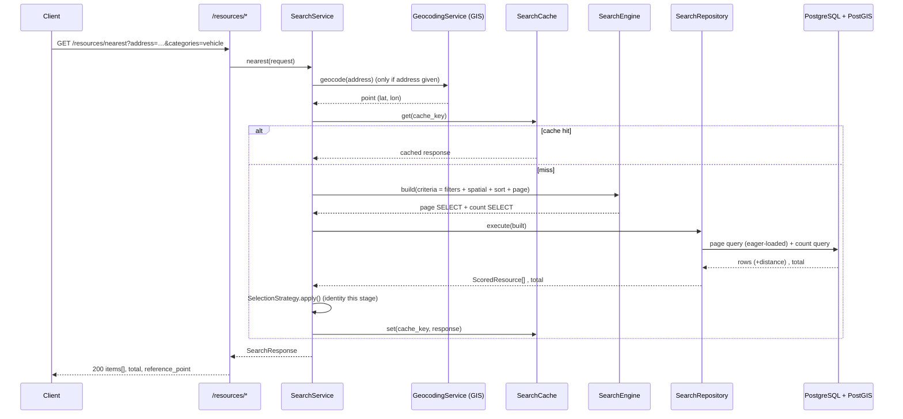
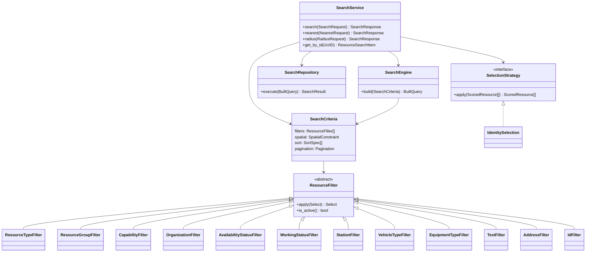

# Universal Resource Search Engine (Stage 4)

A universal engine (`backend/app/search/`) that finds **any** resource — fire
station, vehicle, hydrant, water source, hospital, police unit, … — through one
algorithm. Search runs over the core `Resource` entity; a resource's *kind* is
just another filter, so a new type needs **no** change to the engine.

Built on the Stage-2 models and the Stage-3 GIS module without changing them.

> **Out of scope (by constraint):** automatic unit selection, routing, ETA, map
> rendering, AI. The engine returns *candidate sets*; a `SelectionStrategy` seam
> lets the next stage add selection without touching the engine.

## Module layout

```
backend/app/search/
├── criteria.py          # SearchCriteria, SortSpec, SpatialConstraint, Pagination
├── engine.py            # SearchEngine — builds the composed SELECT + COUNT
├── cache.py             # search result cache factory (Redis-ready)
├── filters/             # composable ResourceFilter classes
├── algorithms/
│   ├── spatial.py       # PostGIS expression builders (ST_DWithin, KNN, …)
│   └── selection.py     # SelectionStrategy seam (next stage plugs in here)
├── repositories/        # SearchRepository — executes page + count (no N+1)
├── services/            # SearchService — GIS + filters + engine + cache
├── schemas/             # SearchRequest/Response, Filter/Nearest/Radius/Pagination
├── utils/               # request→filter mapping, ORM→item mapping, cache keys
├── deps.py              # DI wiring
├── router.py
└── api/                 # /resources/* endpoints
```

## How a search flows



## Class overview



## The algorithm

1. **Resolve reference** — if the request carries `lat/lon`, use it; else if it
   carries an `address`, geocode it (GIS) to a point.
2. **Cache** — build a stable key from the request + reference; return the cached
   `SearchResponse` on a hit (short TTL, Redis-ready interface).
3. **Compose the query** (`SearchEngine.build`) over `Resource`:
   - always exclude soft-deleted rows;
   - apply every active **filter** (AND) — one-to-many/specialization filters use
     correlated `EXISTS`, so the main query never multiplies rows (no `DISTINCT`);
   - apply the **spatial** constraint (`ST_DWithin` radius / `ST_Within` polygon /
     administrative-area / `ST_MakeEnvelope` bbox);
   - if a reference point exists, add a `ST_Distance` (geography, metres) column;
   - apply **sort** (distance via KNN `<->`, name, organization, status, type,
     priority, readiness) — related sort fields use a single outer join each;
   - apply **pagination** (`LIMIT`/`OFFSET`);
   - attach **eager-loading** options (`selectinload`) for the rendered relations.
4. **Execute** (`SearchRepository`) — two queries total: the page and the count.
5. **Select** — apply the `SelectionStrategy` (identity now).
6. **Map** each `ScoredResource` to a `ResourceSearchItem` using only
   eager-loaded relations (no N+1).

### Performance

- GiST **spatial index** on `resources.geom`; `ST_DWithin`/KNN are index-assisted.
- Composite/partial indexes from Stage 2 (e.g. `ix_resources_active`).
- **No N+1**: `selectinload` batches related rows; filters use `EXISTS`, not joins
  that multiply rows. Each search is exactly two SQL round-trips.
- **Result caching** with a short TTL (`SEARCH_CACHE_*`).

## REST API

Mounted under `/api/v1`:

| Method & path | Purpose |
|---------------|---------|
| `GET /resources/search`  | full combinable search (filters + spatial + sort + page) |
| `GET /resources/nearest` | nearest resources to a point or geocoded address |
| `GET /resources/radius`  | resources within a radius |
| `GET /resources/filter`  | attribute-only filtering (no spatial reference) |
| `GET /resources/{id}`    | a single resource |

**Filters** (query params, all optional, freely combinable): `ids`,
`resource_type_ids`, `categories` (resource groups), `organization_ids`,
`availability_status_ids`, `capability_ids` + `capability_match_all`,
`station_ids`, `vehicle_type_ids`, `equipment_type_ids`, `is_active`,
`operational`, `deployable`, `q` (partial name), `code`, `address_contains`.

**Spatial**: `lat`, `lon`, `radius_m`, `area_id`, `polygon_wkt`, `bbox`,
`address`. **Sort**: repeated `sort` (e.g. `sort=distance&sort=-name`).
**Pagination**: `limit`, `offset`.

### Examples

**Nearest 3 available vehicles to an address:**

```
GET /api/v1/resources/nearest?address=Красная площадь, Москва
    &categories=vehicle&deployable=true&limit=3
```

```json
{
  "total": 3, "limit": 3, "offset": 0, "count": 3,
  "reference_point": {"latitude": 55.7539, "longitude": 37.6208},
  "from_cache": false,
  "items": [
    {
      "id": "…", "code": "AC-1", "name": "Автоцистерна 1", "is_active": true,
      "latitude": 55.752, "longitude": 37.6175, "distance_meters": 296.4,
      "resource_type": {"id": "…", "code": "AC", "name": "Автоцистерна", "category": "vehicle"},
      "organization": {"id": "…", "code": "PCH1", "name": "ПЧ-1"},
      "availability_status": {"id": "…", "code": "AVAILABLE", "name": "Свободен"},
      "specialization": "vehicle"
    }
  ]
}
```

**Resources within 5 km with a capability, sorted by distance:**

```
GET /api/v1/resources/radius?lat=55.7539&lon=37.6208&radius_m=5000
    &capability_ids=<uuid>&sort=distance
```

**Hydrants inside an administrative area:**

```
GET /api/v1/resources/search?categories=infrastructure&area_id=<uuid>
```

**Combined attribute filter with pagination:**

```
GET /api/v1/resources/filter?organization_ids=<uuid>&operational=true
    &sort=-name&limit=20&offset=0
```

## Ready for the next stage

Automatic unit selection plugs a `SelectionStrategy` into `SearchService`
(constructor injection) to re-rank / cap the `ScoredResource` candidates the
engine already produces — **no change to the SearchEngine, filters or API**.
Every filter, spatial op, sort and the distance annotation are already available
for a selection algorithm to weigh.
